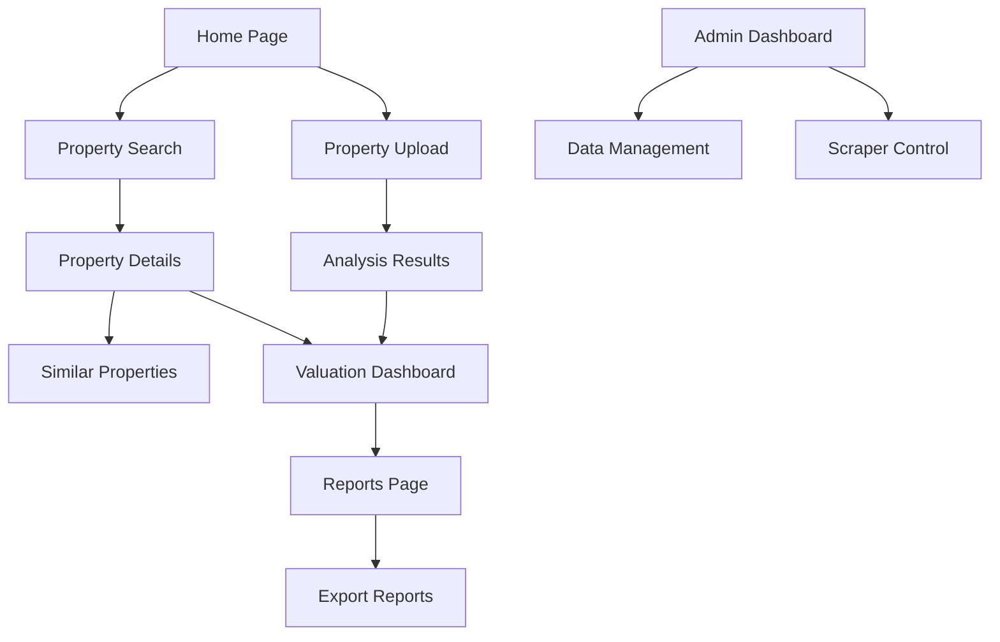

# MVP Implementation Plan - Real Estate Analysis Platform

## 1. Product Overview
A comprehensive real estate analysis platform for the Vietnamese market that provides intelligent data collection, property valuation, market analysis, and property comparison features. The platform targets banking professionals, property seekers, trend analysts, and real estate agents with automated valuation models (AVM) and advanced search capabilities.

## 2. Core Features

### 2.1 User Roles
| Role | Registration Method | Core Permissions |
|------|---------------------|------------------|
| Default User | Direct access (no auth required for MVP) | Can search properties, view details, upload properties, get valuations |
| Admin User | System-generated | Can manage all data, view analytics, export reports |

### 2.2 Feature Module
Our real estate platform MVP consists of the following main pages:
1. **Home Page**: hero section with search bar, featured properties grid, market statistics dashboard
2. **Property Search Page**: advanced search filters, map view, property listing grid, sorting options
3. **Property Details Page**: comprehensive property information, similar properties, valuation estimates, image gallery
4. **Property Upload Page**: property information form, image upload, document upload, analysis results
5. **Valuation Dashboard**: AVM results, market comparisons, price trends, valuation history
6. **Reports Page**: export functionality, custom report generation, market analysis reports
7. **Admin Dashboard**: data management, scraper status, system analytics, user management

### 2.3 Page Details
| Page Name | Module Name | Feature Description |
|-----------|-------------|---------------------|
| Home Page | Hero Section | Display search bar with location autocomplete, property type filters |
| Home Page | Featured Properties | Show 6-8 highlighted properties with images, price, location |
| Home Page | Market Statistics | Display key market metrics, price trends, transaction volumes |
| Property Search | Search Filters | Filter by location, price range, property type, size, amenities |
| Property Search | Map Integration | Interactive map showing property locations with clustering |
| Property Search | Results Grid | Paginated property listings with sorting and view options |
| Property Details | Property Information | Complete property details, specifications, legal information |
| Property Details | Image Gallery | High-resolution property images with lightbox viewer |
| Property Details | Valuation Display | AVM estimate, confidence score, price range, market comparison |
| Property Details | Similar Properties | AI-powered similar property recommendations |
| Property Upload | Property Form | Comprehensive form for property details, validation, auto-complete |
| Property Upload | File Upload | Support for images, documents, with preview and progress |
| Property Upload | Analysis Results | Real-time property analysis, valuation, similar properties |
| Valuation Dashboard | AVM Results | Automated valuation with confidence intervals and methodology |
| Valuation Dashboard | Market Analysis | Comparative market analysis, price trends, neighborhood data |
| Reports Page | Report Templates | Pre-built report templates for property analysis, market research, valuation summaries |
| Reports Page | Custom Report Builder | Drag-and-drop interface to build custom reports with selected metrics, charts, and filters |
| Reports Page | Export Tools | Generate reports in PDF, Excel, Word formats with professional styling |
| Reports Page | Report History | Save, manage, and re-generate previous reports with updated data |
| Reports Page | Batch Export | Export multiple properties or valuations in bulk with customizable templates |
| Admin Dashboard | Data Management | Manage properties, users, system settings, data quality |
| Admin Dashboard | Scraper Control | Monitor and control web scraping operations, data sources |

## 3. Core Process

### Main User Flow
1. User visits homepage and sees featured properties and market overview
2. User searches for properties using filters or map interface
3. User views property details including AVM valuation and similar properties
4. User can upload their own property for analysis and valuation
5. User generates and exports reports based on their research

### Admin Flow
1. Admin monitors system health and data quality through dashboard
2. Admin manages scraping operations and data sources
3. Admin reviews and validates uploaded properties
4. Admin generates system reports and analytics



## 4. User Interface Design

### 4.1 Design Style
- **Primary Colors**: #2563eb (blue), #059669 (green), #dc2626 (red for alerts)
- **Secondary Colors**: #64748b (gray), #f8fafc (light background)
- **Button Style**: Rounded corners (8px), solid fills with hover effects
- **Typography**: Inter font family, 16px base size, clear hierarchy
- **Layout**: Card-based design with clean spacing, top navigation with breadcrumbs
- **Icons**: Heroicons for consistency, property-specific icons for amenities

### 4.2 Page Design Overview
| Page Name | Module Name | UI Elements |
|-----------|-------------|-------------|
| Home Page | Hero Section | Full-width background image, centered search bar, gradient overlay |
| Home Page | Featured Properties | 3-column grid on desktop, property cards with hover effects |
| Property Search | Search Filters | Collapsible sidebar, range sliders, multi-select dropdowns |
| Property Search | Map View | Full-height map with property markers, info popups |
| Property Details | Image Gallery | Large main image with thumbnail strip, lightbox modal |
| Property Details | Information Tabs | Tabbed interface for details, location, valuation, documents |
| Property Upload | Form Layout | Multi-step wizard with progress indicator, validation feedback |
| Valuation Dashboard | Charts | Interactive charts for price trends, confidence meters |
| Reports Page | Export Interface | Table view with selection checkboxes, export format options |
| Admin Dashboard | Analytics Grid | KPI cards, data tables, status indicators |

### 4.3 Responsiveness
Desktop-first design with mobile-adaptive breakpoints at 768px and 1024px. Touch-optimized interactions for mobile devices with larger tap targets and swipe gestures for image galleries.

## 5. Report Generation & Export System

### 5.1 Report Types & Templates

#### 5.1.1 Pre-built Report Templates
- **Property Analysis Report**: Comprehensive property details, valuation, market comparison, investment analysis
- **Market Research Report**: Area analysis, price trends, transaction volumes, market forecasts
- **Valuation Summary Report**: AVM results, confidence intervals, comparable properties, methodology
- **Portfolio Report**: Multiple property analysis, performance metrics, risk assessment
- **Comparative Market Analysis (CMA)**: Side-by-side property comparisons with charts and metrics

#### 5.1.2 Custom Report Builder Features
- **Drag-and-drop interface** for selecting report sections
- **Chart types**: Bar charts, line graphs, pie charts, scatter plots, heatmaps
- **Data filters**: Date ranges, property types, price ranges, locations
- **Styling options**: Company branding, color schemes, fonts, logos
- **Template saving**: Save custom templates for reuse

### 5.2 Export Formats & Specifications

#### 5.2.1 PDF Export
- **Professional styling** with headers, footers, page numbers
- **Interactive charts** converted to high-resolution images
- **Table formatting** with alternating row colors and borders
- **Map integration** with property location screenshots
- **Digital signatures** for official reports
- **Watermarks** for draft/final versions

#### 5.2.2 Excel Export
- **Multiple worksheets** for different data categories
- **Formulas and calculations** for dynamic analysis
- **Charts and graphs** embedded in worksheets
- **Data validation** and dropdown lists
- **Conditional formatting** for highlighting key metrics
- **Pivot tables** for advanced data analysis

#### 5.2.3 Word Export
- **Professional document templates** with consistent formatting
- **Table of contents** with automatic page references
- **Charts and images** properly embedded
- **Mail merge capabilities** for batch reports
- **Track changes** for collaborative editing
- **Comments and annotations** for review processes

### 5.3 Report Data Models

#### 5.3.1 Report Template Schema
```json
{
  "template_id": "string",
  "name": "string",
  "description": "string",
  "category": "property|market|valuation|portfolio",
  "sections": [
    {
      "section_id": "string",
      "title": "string",
      "type": "text|chart|table|map|image",
      "data_source": "string",
      "styling": {}
    }
  ],
  "styling": {
    "theme": "string",
    "colors": [],
    "fonts": {},
    "logo": "string"
  }
}
```

#### 5.3.2 Export Request Schema
```json
{
  "template_id": "string",
  "format": "pdf|excel|word",
  "data_filters": {
    "property_ids": [],
    "date_range": {},
    "location": "string",
    "price_range": {}
  },
  "customizations": {
    "title": "string",
    "subtitle": "string",
    "company_info": {},
    "watermark": "string"
  }
}
```

### 5.4 Background Processing
- **Celery tasks** for heavy report generation
- **Progress tracking** with WebSocket updates
- **Queue management** for concurrent report requests
- **File storage** with expiration policies
- **Email delivery** for completed reports

## 6. Technical Architecture

### 5.1 Database Layer
- **PostgreSQL 14+** with PostGIS extension for geospatial data
- **Redis** for caching and session management
- **AWS S3** or local storage for file uploads

### 5.2 Backend Services
- **FastAPI** with async/await for high performance
- **SQLAlchemy** with Alembic for database migrations
- **Pydantic** for data validation and serialization
- **Celery** for background tasks (scraping, analysis, report generation)
- **ReportLab** for PDF generation with charts and styling
- **openpyxl** for Excel file generation with formulas and charts
- **python-docx** for Word document generation with templates
- **Jinja2** for report template rendering
- **Matplotlib/Plotly** for chart generation in reports

### 5.3 Web Scraping
- **Ulixee Hero** for advanced scraping with browser emulation
- **Scrapy** for structured data extraction
- **Proxy rotation** for anti-detection
- **Rate limiting** and respectful scraping practices

### 5.4 Frontend
- **React 18** with TypeScript
- **Tailwind CSS** for styling
- **React Query** for API state management
- **React Router** for navigation
- **Leaflet** for map integration

### 5.5 API Endpoints
- `GET /api/v1/properties` - Search and list properties
- `GET /api/v1/properties/{id}` - Get property details
- `POST /api/v1/properties` - Create new property
- `POST /api/v1/properties/upload` - Upload property with files
- `POST /api/v1/valuations` - Request property valuation
- `GET /api/v1/properties/{id}/similar` - Get similar properties
- `POST /api/v1/reports/generate` - Generate custom reports with templates
- `POST /api/v1/reports/export/pdf` - Export reports as PDF with styling
- `POST /api/v1/reports/export/excel` - Export data as Excel with charts
- `POST /api/v1/reports/export/word` - Export reports as Word documents
- `GET /api/v1/reports/templates` - Get available report templates
- `POST /api/v1/reports/templates` - Create custom report templates
- `GET /api/v1/reports/history` - Get user's report history
- `POST /api/v1/reports/batch` - Generate batch reports for multiple properties
- `GET /api/v1/admin/scraper/status` - Monitor scraping status

## 7. User Journey Optimization

### 7.1 First-Time User Experience
- **Welcome Tour**: Interactive 3-step onboarding highlighting key features
- **Sample Property**: Pre-loaded demo property for immediate exploration
- **Quick Start Guide**: Visual cards showing common use cases
- **Progressive Registration**: Allow basic usage before requiring account creation
- **Success Metrics**: Track time-to-first-value and feature adoption

### 7.2 Property Analysis Journey
- **Smart Address Input**: Auto-complete with Google Places API integration
- **Confidence Indicators**: Show data quality and valuation confidence levels
- **Alternative Suggestions**: Offer nearby properties if exact match not found
- **Comparison Mode**: Easy toggle to compare multiple properties side-by-side
- **Save for Later**: One-click saving with organized collections

### 7.3 Report Generation Experience
- **Template Preview**: Show report samples before generation
- **Customization Wizard**: Step-by-step report configuration
- **Real-Time Preview**: Live preview as users modify report settings
- **Delivery Options**: Email, download, or cloud storage integration
- **Sharing Features**: Generate shareable links with access controls

### 7.4 Error Handling & Recovery
- **Graceful Degradation**: Show partial results when some data is unavailable
- **Smart Retry Logic**: Automatic retry with exponential backoff for failed operations
- **Alternative Data Sources**: Fallback to secondary sources when primary fails
- **User-Friendly Errors**: Plain language explanations with suggested actions
- **Contact Support**: Easy access to help with context-aware pre-filled forms

## 8. Implementation Phases

### Phase 1: Foundation & CX Framework (Week 1-2)
- Database setup with core tables and report templates table
- Basic FastAPI structure with authentication and comprehensive error handling
- Property CRUD operations with validation
- React frontend with design system and accessibility foundation
- Report template system foundation
- **CX Focus**: Error boundaries, loading states, responsive design

### Phase 2: Core Features & User Workflows (Week 3-4)
- Property search and filtering with smart auto-suggestions
- File upload functionality with drag-and-drop and validation
- Basic AVM implementation with confidence indicators
- Property details page with interactive comparisons
- Basic report generation (PDF export) with progress tracking
- **CX Focus**: Real-time feedback, progressive disclosure, mobile optimization

### Phase 3: Advanced Features & Personalization (Week 5-6)
- Web scraping implementation with progress tracking
- Similar property matching with visual comparisons
- Valuation dashboard with personalized widgets
- Advanced report generation (Excel, Word export)
- Custom report builder interface with real-time preview
- **CX Focus**: Personalization, smart recommendations, offline capabilities

### Phase 4: Report System & CX Validation (Week 7-8)
- Comprehensive report templates with customization
- Batch export functionality with progress indicators
- Report history and management with sharing features
- Background processing with Celery and user notifications
- Comprehensive usability testing and A/B testing
- Admin dashboard with report analytics and CX metrics
- **CX Focus**: User feedback integration, performance metrics, continuous improvement

## 9. Customer Experience (CX) Excellence

### 8.1 User-Centric Design Principles
- **Progressive Disclosure**: Show essential information first, advanced features on demand
- **Contextual Help**: Inline tooltips, guided tours, and smart suggestions
- **Predictive UX**: Auto-complete addresses, smart defaults, saved preferences
- **Error Prevention**: Real-time validation, clear constraints, helpful error messages
- **Accessibility First**: WCAG 2.1 AA compliance, keyboard navigation, screen reader support

### 8.2 Intuitive User Workflows
- **One-Click Property Analysis**: Single button to start valuation with smart defaults
- **Smart Property Detection**: Auto-fill property details from address or coordinates
- **Visual Progress Indicators**: Real-time scraping progress with estimated completion time
- **Contextual Actions**: Show relevant next steps based on current user state
- **Undo/Redo Functionality**: Allow users to easily reverse actions

### 8.3 Performance & Responsiveness
- **Sub-3-Second Loading**: Optimize critical rendering path and lazy load non-essential content
- **Skeleton Screens**: Show content placeholders while data loads
- **Optimistic UI Updates**: Show expected results immediately, sync in background
- **Offline Capability**: Cache recent searches and allow basic functionality offline
- **Progressive Web App**: Native app-like experience with push notifications

### 8.4 Personalization & Intelligence
- **Smart Recommendations**: Suggest similar properties based on user behavior
- **Customizable Dashboard**: Let users arrange widgets and save preferred views
- **Search History**: Quick access to recent searches with filters
- **Saved Searches**: Alert users when new properties match their criteria
- **Learning Preferences**: Adapt interface based on user's most-used features

### 8.5 Communication & Feedback
- **Real-Time Notifications**: WebSocket-based updates for long-running operations
- **Clear Status Messages**: Informative feedback for all user actions
- **Progress Transparency**: Show what's happening during scraping and analysis
- **Error Recovery**: Provide clear next steps when something goes wrong
- **Success Celebrations**: Positive feedback for completed actions

### 8.6 Mobile-First Experience
- **Touch-Optimized Interface**: Large tap targets, swipe gestures, pull-to-refresh
- **Responsive Maps**: Optimized map interactions for mobile devices
- **Voice Input**: Allow address input via speech recognition
- **Camera Integration**: Photo upload for property documentation
- **Location Services**: Auto-detect user location for nearby property searches

### 8.7 Data Visualization Excellence
- **Interactive Charts**: Hover effects, drill-down capabilities, export options
- **Color-Coded Insights**: Intuitive color schemes for price ranges and trends
- **Comparative Views**: Side-by-side property comparisons with highlighting
- **Map Clustering**: Smart grouping of nearby properties with zoom-based detail levels
- **Timeline Visualizations**: Historical price trends with interactive scrubbing

### 8.8 Testing Strategy

#### 8.8.1 User Experience Testing
- **Usability Testing**: Task-based testing with real users
- **A/B Testing**: Compare different UI approaches for key workflows
- **Accessibility Testing**: Screen reader compatibility, keyboard navigation
- **Performance Testing**: Core Web Vitals, mobile performance metrics
- **Cross-Browser Testing**: Consistent experience across all major browsers

#### 8.8.2 Backend Testing
- Unit tests for all service functions
- Integration tests for API endpoints
- Database migration tests
- Scraper functionality tests
- **Report generation tests** for all export formats
- **Template rendering tests** with various data sets
- **Background task tests** for Celery workers

#### 8.8.3 Frontend Testing
- Component unit tests with Jest/React Testing Library
- Integration tests for user flows
- E2E tests with Playwright
- Accessibility testing
- **Report builder interface tests**
- **Export functionality tests** across browsers
- **File download and preview tests**

#### 8.8.4 Performance Testing
- API response time benchmarks
- Database query optimization
- Frontend bundle size optimization
- Load testing for concurrent users
- **Report generation performance** under load
- **Large dataset export tests** (1000+ properties)
- **Concurrent report generation** stress testing

#### 8.8.5 Report Quality Testing
- **PDF output validation** for formatting and charts
- **Excel formula verification** and data integrity
- **Word document structure** and template consistency
- **Cross-platform compatibility** testing
- **Print quality assessment** for physical reports

## 9. Success Metrics

### 9.1 Technical Metrics
- API response time < 500ms
- Page load time < 2 seconds
- 99.9% uptime
- Test coverage > 80%
- **Report generation time < 30 seconds** for standard reports
- **Export success rate > 98%** across all formats
- **Background task completion rate > 95%**

### 9.2 User Metrics
- Property search accuracy > 90%
- AVM accuracy > 85%
- User session duration > 5 minutes
- Property upload completion rate > 70%
- **Report generation usage > 60%** of active users
- **Custom template creation > 25%** of power users
- **Report download completion rate > 90%**

### 9.3 Report Quality Metrics
- **Template rendering accuracy > 99%**
- **Chart generation success rate > 98%**
- **Data consistency across formats > 99.5%**
- **User satisfaction with report quality > 4.5/5**

## 10. Frontend Report Components

### 10.1 Report Builder Interface
- **Template Selector**: Grid view of available templates with previews
- **Section Editor**: Drag-and-drop interface for customizing report sections
- **Data Filter Panel**: Interactive filters for date ranges, properties, locations
- **Chart Configuration**: Chart type selection, data series configuration
- **Styling Panel**: Color schemes, fonts, branding options
- **Preview Mode**: Real-time preview of report layout

### 10.2 Export Interface Components
- **Format Selector**: Radio buttons for PDF, Excel, Word selection
- **Progress Indicator**: Real-time progress bar for report generation
- **Download Manager**: Queue of generated reports with download links
- **Batch Selection**: Checkbox interface for multi-property exports
- **Email Delivery**: Optional email sending for large reports

### 10.3 Report Management
- **Report History**: Table view of previously generated reports
- **Template Library**: User's saved custom templates
- **Sharing Options**: Link sharing and collaboration features
- **Version Control**: Track report versions and changes

## 11. Deployment & Infrastructure

### 11.1 Development Environment
- Docker containers for consistent development
- Local PostgreSQL and Redis instances
- Hot reload for both frontend and backend

### 11.2 Production Deployment
- Cloud deployment (AWS/GCP/Azure)
- Container orchestration with Docker Compose
- CI/CD pipeline with automated testing
- Environment-specific configuration management

## 12. Data Sources & Scraping Targets

### 12.1 Primary Sources
- batdongsan.com.vn - Main Vietnamese real estate portal
- alonhadat.com.vn - Secondary real estate listings
- nhadat24h.net - Additional property data

### 12.2 Scraping Strategy
- Respectful scraping with delays and rate limiting
- User agent rotation and proxy usage
- Data validation and deduplication
- Incremental updates to avoid full re-scraping

This implementation plan provides a comprehensive roadmap for building a production-ready real estate analysis platform that meets all MVP requirements while maintaining high code quality and user experience standards.