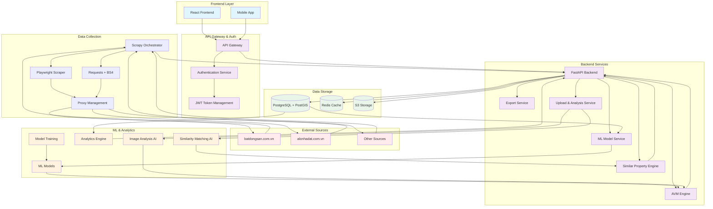

# Tài liệu Yêu cầu Sản phẩm: Nền tảng Phân tích Bất động sản

**Ngày:** 7 tháng 7, 2025  
**Tác giả:** Nem Arin  
**Tình trạng:** Hoàn thiện

## Mục lục

### 1. [Giới thiệu](#1-giới-thiệu)
- [1.1. Tổng quan Hệ thống](#11-tổng-quan-hệ-thống)
- [1.2. Đối tượng Người dùng Chính](#12-đối-tượng-người-dùng-chính)
- [1.3. Giá trị Cốt lõi](#13-giá-trị-cốt-lõi)

### 2. [Mục tiêu và Tầm nhìn](#2-mục-tiêu-và-tầm-nhìn)
- [2.1. Mục tiêu theo Nhóm Người dùng](#21-mục-tiêu-theo-nhóm-người-dùng)
  - [2.1.1. Chuyên viên Ngân hàng (Banking Professionals)](#211-chuyên-viên-ngân-hàng-banking-professionals)
  - [2.1.2. Người tìm kiếm BĐS (Property Seekers)](#212-người-tìm-kiếm-bđs-property-seekers)
  - [2.1.3. Nhà phân tích Xu hướng (Trend Analysts)](#213-nhà-phân-tích-xu-hướng-trend-analysts)
  - [2.1.4. Môi giới & Chuyên gia BĐS](#214-môi-giới--chuyên-gia-bđs)
- [2.2. Mục tiêu Kinh doanh](#22-mục-tiêu-kinh-doanh)
  - [2.2.1. Mục tiêu Ngắn hạn (6-12 tháng)](#221-mục-tiêu-ngắn-hạn-6-12-tháng)
  - [2.2.2. Mục tiêu Trung hạn (1-2 năm)](#222-mục-tiêu-trung-hạn-1-2-năm)
  - [2.2.3. Mục tiêu Dài hạn (3-5 năm)](#223-mục-tiêu-dài-hạn-3-5-năm)
- [2.3. Mục tiêu Sản phẩm](#23-mục-tiêu-sản-phẩm)
  - [2.3.1. Tính năng Cốt lõi](#231-tính-năng-cốt-lõi)
  - [2.3.2. Tính năng Nâng cao](#232-tính-năng-nâng-cao)
  - [2.3.3. Tính năng Tương lai](#233-tính-năng-tương-lai)

### 3. [Phân tích Người dùng (User Personas)](#3-phân-tích-người-dùng-user-personas)
- [3.1. Tổng quan về Người dùng](#31-tổng-quan-về-người-dùng)
- [3.2. Người dùng Chính (Primary Personas)](#32-người-dùng-chính-primary-personas)
  - [3.2.1. Chuyên viên Ngân hàng (Banking Professionals)](#321-chuyên-viên-ngân-hàng-banking-professionals)
  - [3.2.2. Người tìm kiếm Bất động sản (Property Seekers)](#322-người-tìm-kiếm-bất-động-sản-property-seekers)
  - [3.2.3. Nhà phân tích Xu hướng (Trend Analysts)](#323-nhà-phân-tích-xu-hướng-trend-analysts)
- [3.3. Người dùng Phụ (Secondary Personas)](#33-người-dùng-phụ-secondary-personas)
  - [3.3.1. Chủ sở hữu BĐS (Property Owners)](#331-chủ-sở-hữu-bđs-property-owners)
  - [3.3.2. Môi giới BĐS (Real Estate Agents)](#332-môi-giới-bđs-real-estate-agents)
  - [3.3.3. Nhà phát triển Dự án (Property Developers)](#333-nhà-phát-triển-dự-án-property-developers)
  - [3.3.4. Nhà nghiên cứu & Học giả (Researchers & Academics)](#334-nhà-nghiên-cứu--học-giả-researchers--academics)
  - [3.3.5. Nhà báo & Truyền thông (Journalists & Media)](#335-nhà-báo--truyền-thông-journalists--media)
- [3.4. Phân tích Hành vi Người dùng](#34-phân-tích-hành-vi-người-dùng)
  - [3.4.1. Tần suất Sử dụng](#341-tần-suất-sử-dụng)
  - [3.4.2. Thời gian Sử dụng](#342-thời-gian-sử-dụng)
  - [3.4.3. Thiết bị Sử dụng](#343-thiết-bị-sử-dụng)
- [3.5. Yêu cầu Tính năng theo Persona](#35-yêu-cầu-tính-năng-theo-persona)
- [3.6. Chiến lược Phát triển Tính năng](#36-chiến-lược-phát-triển-tính-năng)

### 4. [Tính năng Hệ thống (System Features)](#4-tính-năng-hệ-thống-system-features)
- [4.1. Tổng quan Tính năng](#41-tổng-quan-tính-năng)
- [4.2. Tính năng Cốt lõi (Core Features)](#42-tính-năng-cốt-lõi-core-features)
  - [4.2.1. Thu thập và Quản lý Dữ liệu](#421-thu-thập-và-quản-lý-dữ-liệu)
  - [4.2.2. Tìm kiếm và Lọc](#422-tìm-kiếm-và-lọc)
  - [4.2.3. Hiển thị và So sánh](#423-hiển-thị-và-so-sánh)
  - [4.2.4. Upload và Phân tích BĐS](#424-upload-và-phân-tích-bđs)
  - [4.2.5. Chi tiết Tính năng Upload và Phân tích](#425-chi-tiết-tính-năng-upload-và-phân-tích)
- [4.3. Tính năng Định giá (Valuation Features)](#43-tính-năng-định-giá-valuation-features)
  - [4.3.1. AVM (Automated Valuation Model)](#431-avm-automated-valuation-model)
  - [4.3.2. Manual Valuation](#432-manual-valuation)
- [4.4. Tính năng Phân tích (Analytics Features)](#44-tính-năng-phân-tích-analytics-features)
  - [4.4.1. Market Analytics](#441-market-analytics)
  - [4.4.2. Statistical Reports](#442-statistical-reports)
- [4.5. Tính năng Người dùng (User Features)](#45-tính-năng-người-dùng-user-features)
  - [4.5.1. Authentication & Authorization](#451-authentication--authorization)
  - [4.5.2. User Management](#452-user-management)
- [4.6. Tính năng Xuất báo cáo (Export Features)](#46-tính-năng-xuất-báo-cáo-export-features)
  - [4.6.1. Report Generation](#461-report-generation)
  - [4.6.2. Data Export](#462-data-export)
- [4.7. Tính năng Nâng cao (Advanced Features)](#47-tính-năng-nâng-cao-advanced-features)
  - [4.7.1. AI & Machine Learning](#471-ai--machine-learning)
  - [4.7.2. Integration & API](#472-integration--api)
- [4.8. Tính năng Mobile (Mobile Features)](#48-tính-năng-mobile-mobile-features)
  - [4.8.1. Mobile App](#481-mobile-app)
- [4.9. Tính năng Bảo mật (Security Features)](#49-tính-năng-bảo-mật-security-features)
  - [4.9.1. Data Protection](#491-data-protection)
- [4.10. Tính năng Hiệu suất (Performance Features)](#410-tính-năng-hiệu-suất-performance-features)
  - [4.10.1. Optimization](#4101-optimization)
- [4.11. Lộ trình Phát triển Tính năng](#411-lộ-trình-phát-triển-tính-năng)
  - [4.11.1. MVP (Giai đoạn 1 - 3 tháng)](#4111-mvp-giai-đoạn-1---3-tháng)
  - [4.11.2. Giai đoạn 2 (3-6 tháng)](#4112-giai-đoạn-2-3-6-tháng)
  - [4.11.3. Giai đoạn 3 (6-12 tháng)](#4113-giai-đoạn-3-6-12-tháng)
- [4.12. Metrics & KPIs](#412-metrics--kpis)
  - [4.12.1. Performance Metrics](#4121-performance-metrics)
  - [4.12.2. User Engagement Metrics](#4122-user-engagement-metrics)

### 5. [Thiết kế Hệ thống & Kiến trúc](#5-thiết-kế-hệ-thống--kiến-trúc)
- [5.1. Thiết kế Tổng quan (Overall System Design)](#51-thiết-kế-tổng-quan-overall-system-design)
  - [5.1.1. Kiến trúc Tổng thể Hệ thống](#511-kiến-trúc-tổng-thể-hệ-thống)
  - [5.1.2. Mô tả Chi tiết Kiến trúc Hệ thống](#512-mô-tả-chi-tiết-kiến-trúc-hệ-thống)
  - [5.1.3. Luồng Dữ liệu Chính](#513-luồng-dữ-liệu-chính)
  - [5.1.4. Các Nguyên tắc Thiết kế](#514-các-nguyên-tắc-thiết-kế)
  - [5.1.5. Công nghệ Stack](#515-công-nghệ-stack)
- [5.2. Thiết kế Cơ sở dữ liệu (Database Design)](#52-thiết-kế-cơ-sở-dữ-liệu-database-design)
  - [5.2.1. Tổng quan Kiến trúc Cơ sở dữ liệu](#521-tổng-quan-kiến-trúc-cơ-sở-dữ-liệu)
  - [5.2.2. Cấu trúc Bảng chính](#522-cấu-trúc-bảng-chính)
  - [5.2.3. Mối quan hệ và Khóa ngoại](#523-mối-quan-hệ-và-khóa-ngoại)
  - [5.2.4. Bảo mật và Phân quyền (Row-Level Security)](#524-bảo-mật-và-phân-quyền-row-level-security)
  - [5.2.5. Tối ưu hóa Hiệu suất](#525-tối-ưu-hóa-hiệu-suất)
  - [5.2.6. Dữ liệu Mẫu và Seeding](#526-dữ-liệu-mẫu-và-seeding)
  - [5.2.7. Backup và Recovery](#527-backup-và-recovery)
  - [5.2.8. Monitoring và Maintenance](#528-monitoring-và-maintenance)
- [5.3. Thiết kế Backend chi tiết (API)](#53-thiết-kế-backend-chi-tiết-api)
  - [5.3.1. Endpoints Xác thực & Người dùng (Authentication & Users)](#531-endpoints-xác-thực--người-dùng-authentication--users)
  - [5.3.2. Endpoints Bất động sản (Properties)](#532-endpoints-bất-động-sản-properties)
  - [5.3.3. Endpoints Định giá & Tương tác (Valuation & Interaction)](#533-endpoints-định-giá--tương-tác-valuation--interaction)
  - [5.3.4. Bảng Thiết kế Chi tiết API Endpoints](#534-bảng-thiết-kế-chi-tiết-api-endpoints)
- [5.4. Tính năng Hệ thống (System Features)](#54-tính-năng-hệ-thống-system-features)
  - [5.4.1. Tổng quan Tính năng](#541-tổng-quan-tính-năng)
  - [5.4.2. Tính năng Cốt lõi (Core Features)](#542-tính-năng-cốt-lõi-core-features)
  - [5.4.3. Tính năng Định giá (Valuation Features)](#543-tính-năng-định-giá-valuation-features)
  - [5.4.4. Tính năng Phân tích (Analytics Features)](#544-tính-năng-phân-tích-analytics-features)
  - [5.4.5. Tính năng Người dùng (User Features)](#545-tính-năng-người-dùng-user-features)
  - [5.4.6. Tính năng Xuất báo cáo (Export Features)](#546-tính-năng-xuất-báo-cáo-export-features)
  - [5.4.7. Tính năng Nâng cao (Advanced Features)](#547-tính-năng-nâng-cao-advanced-features)
  - [5.4.8. Tính năng Mobile (Mobile Features)](#548-tính-năng-mobile-mobile-features)
  - [5.4.9. Tính năng Bảo mật (Security Features)](#549-tính-năng-bảo-mật-security-features)
  - [5.4.10. Tính năng Hiệu suất (Performance Features)](#5410-tính-năng-hiệu-suất-performance-features)
  - [5.4.11. Lộ trình Phát triển Tính năng](#5411-lộ-trình-phát-triển-tính-năng)
  - [5.4.12. Metrics & KPIs](#5412-metrics--kpis)

### 6. [Lộ trình Triển khai MVP (Sản phẩm Khả thi Tối thiểu)](#6-lộ-trình-triển-khai-mvp-sản-phẩm-khả-thi-tối-thiểu)
- [6.1. MVP 1: Nền tảng Dữ liệu (Mục tiêu: 1-2 tháng)](#61-mvp-1-nền-tảng-dữ-liệu-mục-tiêu-1-2-tháng)
- [6.2. MVP 2: Lớp Thông minh (Mục tiêu: +2 tháng)](#62-mvp-2-lớp-thông-minh-mục-tiêu-2-tháng)
- [6.3. MVP 3: Bộ công cụ Chuyên nghiệp & Giữ chân Người dùng (Mục tiêu: +2 tháng)](#63-mvp-3-bộ-công-cụ-chuyên-nghiệp--giữ-chân-người-dùng-mục-tiêu-2-tháng)

### 7. [Các Chỉ số Thành công (Success Metrics)](#7-các-chỉ-số-thành-công-success-metrics)
- [7.1. Tương tác Người dùng](#71-tương-tác-người-dùng)
- [7.2. Chất lượng Dữ liệu & "Sức khỏe" của Trình thu thập](#72-chất-lượng-dữ-liệu--sức-khỏe-của-trình-thu-thập)
- [7.3. Chuyển đổi & Mức độ chấp nhận của Người dùng Chuyên nghiệp](#73-chuyển-đổi--mức-độ-chấp-nhận-của-người-dùng-chuyên-nghiệp)

---

## 1. Giới thiệu

Tài liệu này phác thảo các yêu cầu về chức năng và kỹ thuật cho Nền tảng Phân tích Bất động sản. Mục tiêu chính của nền tảng là trao quyền cho người dùng—từ người mua và bán cá nhân đến các chuyên viên ngân hàng, thẩm định viên chuyên nghiệp, và nhà phân tích thị trường—với những hiểu biết toàn diện, dựa trên dữ liệu về thị trường bất động sản Việt Nam.

### 1.1. Tổng quan Hệ thống

Hệ thống sẽ đạt được điều này bằng cách:

- **Thu thập Dữ liệu Thông minh:** Tổng hợp dữ liệu một cách có đạo đức và mạnh mẽ từ các trang web bất động sản lớn của Việt Nam, có khả năng xử lý các trang web động, sử dụng JavaScript và AI để phát hiện trùng lặp.
- **Làm giàu Dữ liệu:** Bổ sung thông tin pháp lý, quy hoạch công khai, và phân tích hình ảnh để tạo ra dữ liệu toàn diện.
- **Định giá AI:** Cung cấp Mô hình Định giá Tự động (AVM) với độ chính xác 85-90%, kết hợp với chức năng định giá thủ công cho chuyên gia.
- **Phân tích Thị trường:** Dashboard phân tích xu hướng, so sánh khu vực, và dự báo thị trường cho các nhà phân tích.
- **Upload & Phân tích:** Cho phép người dùng upload thông tin BĐS để nhận phân tích tương tự và định giá chính xác.
- **Tìm kiếm Nâng cao:** Bộ lọc đa tiêu chí, tìm kiếm địa lý, và so sánh BĐS thông minh.
- **Xuất báo cáo:** Hệ thống xuất báo cáo chuyên nghiệp cho ngân hàng và nhà phân tích.

### 1.2. Đối tượng Người dùng Chính

**Chuyên viên Ngân hàng (Banking Professionals):**
- Định giá nhanh chóng tài sản thế chấp
- Báo cáo chuyên nghiệp cho khách hàng
- API tích hợp cho hệ thống nội bộ
- Dashboard phân tích rủi ro

**Người tìm kiếm BĐS (Property Seekers):**
- Tìm kiếm thông minh với bộ lọc đa tiêu chí
- So sánh giá và đánh giá thị trường
- Upload thông tin BĐS để nhận phân tích
- Thông báo BĐS mới phù hợp

**Nhà phân tích Xu hướng (Trend Analysts):**
- Dashboard phân tích thị trường chi tiết
- Dữ liệu lịch sử và xu hướng giá
- API truy cập dữ liệu thô
- Báo cáo thống kê chuyên sâu

**Môi giới & Chuyên gia BĐS:**
- Định giá BĐS để tư vấn khách hàng
- So sánh với BĐS tương tự
- Tạo báo cáo thị trường
- Theo dõi xu hướng thị trường

### 1.3. Giá trị Cốt lõi

Nền tảng này giải quyết nhu cầu thiết yếu của thị trường về dữ liệu bất động sản minh bạch, hợp nhất và thông minh, vượt ra ngoài các danh sách tin đăng đơn giản để cung cấp một nguồn thông tin đáng tin cậy duy nhất cho việc phân tích và định giá tài sản.

## 2. Mục tiêu và Tầm nhìn

### 2.1. Mục tiêu theo Nhóm Người dùng

#### 2.1.1. Chuyên viên Ngân hàng (Banking Professionals)
**Mục tiêu:** Hợp lý hóa quy trình định giá tài sản thế chấp bằng cách sử dụng AVM làm cơ sở, đồng thời vẫn giữ được khả năng áp dụng đánh giá chuyên môn để đưa ra con số cuối cùng chính xác và đáng tin cậy.

**Kết quả mong đợi:**
- Giảm 70% thời gian định giá thủ công
- Tăng độ chính xác định giá lên 90%
- Tạo báo cáo chuyên nghiệp trong <5 phút
- Tích hợp API với hệ thống nội bộ

#### 2.1.2. Người tìm kiếm BĐS (Property Seekers)
**Mục tiêu:** Đưa ra quyết định sáng suốt khi mua, bán hoặc đầu tư BĐS bằng cách truy cập dữ liệu toàn diện, ước tính giá dựa trên AI và các so sánh thị trường tại một nơi duy nhất.

**Kết quả mong đợi:**
- Tìm BĐS phù hợp trong <10 phút
- Định giá chính xác với độ tin cậy 85-90%
- Upload thông tin BĐS để nhận phân tích tương tự
- So sánh giá thị trường real-time

#### 2.1.3. Nhà phân tích Xu hướng (Trend Analysts)
**Mục tiêu:** Cung cấp công cụ phân tích thị trường chuyên sâu với dữ liệu lịch sử toàn diện, xu hướng giá, và dự báo thị trường để hỗ trợ ra quyết định đầu tư và nghiên cứu.

**Kết quả mong đợi:**
- Dashboard phân tích thị trường real-time
- API truy cập dữ liệu thô cho phân tích tùy chỉnh
- Báo cáo xu hướng thị trường hàng tháng/quý
- Dự báo giá với độ chính xác 75-80%

#### 2.1.4. Môi giới & Chuyên gia BĐS
**Mục tiêu:** Tăng hiệu quả tư vấn khách hàng bằng cách cung cấp công cụ định giá chính xác, so sánh thị trường, và báo cáo chuyên nghiệp.

**Kết quả mong đợi:**
- Định giá BĐS trong <2 phút
- Tạo báo cáo thị trường trong <10 phút
- So sánh với BĐS tương tự chính xác
- Theo dõi xu hướng thị trường real-time

### 2.2. Mục tiêu Kinh doanh

#### 2.2.1. Mục tiêu Ngắn hạn (6-12 tháng)
- Trở thành nền tảng hàng đầu cho phân tích dữ liệu BĐS tại Việt Nam
- Đạt 10,000 người dùng đăng ký trong 6 tháng đầu
- Tích hợp với 5 ngân hàng lớn
- Độ chính xác AVM đạt 85-90%

#### 2.2.2. Mục tiêu Trung hạn (1-2 năm)
- Mở rộng ra 10 thành phố lớn
- Đạt 100,000 người dùng đăng ký
- Phát triển mobile app đầy đủ tính năng
- Tích hợp AI/ML nâng cao cho dự báo giá

#### 2.2.3. Mục tiêu Dài hạn (3-5 năm)
- Trở thành nền tảng BĐS hàng đầu Đông Nam Á
- Đạt 1 triệu người dùng đăng ký
- Mở rộng sang các thị trường quốc tế
- Phát triển hệ sinh thái BĐS toàn diện

### 2.3. Mục tiêu Sản phẩm

#### 2.3.1. Tính năng Cốt lõi
- Xây dựng hệ thống thu thập dữ liệu thông minh với khả năng xử lý 1M+ BĐS
- Phát triển AVM với độ chính xác 85-90%
- Tạo giao diện người dùng hiện đại, responsive
- Xây dựng API mạnh mẽ cho tích hợp bên thứ ba

#### 2.3.2. Tính năng Nâng cao
- Upload & phân tích BĐS với AI
- Dashboard phân tích thị trường real-time
- Mobile app với tính năng đầy đủ
- Tích hợp với hệ thống ngân hàng và CRM

#### 2.3.3. Tính năng Tương lai
- AI dự báo giá với độ chính xác 75-80%
- Phân tích tâm lý thị trường
- Hệ thống gợi ý BĐS thông minh
- Tích hợp blockchain cho minh bạch dữ liệu

## 3. Phân tích Người dùng (User Personas)

### 3.1. Tổng quan về Người dùng

Nền tảng Phân tích Bất động sản phục vụ nhiều nhóm người dùng khác nhau, mỗi nhóm có nhu cầu, mục tiêu và hành vi sử dụng riêng biệt. Việc hiểu rõ các persona này giúp thiết kế tính năng và trải nghiệm người dùng phù hợp.

### 3.2. Người dùng Chính (Primary Personas)

#### 3.2.1. Chuyên viên Ngân hàng (Banking Professionals)

**Đặc điểm:**
- **Vai trò:** Chuyên viên thẩm định, quản lý rủi ro, cán bộ tín dụng
- **Tuổi:** 28-45 tuổi
- **Kinh nghiệm:** 3-15 năm trong lĩnh vực tài chính
- **Mục tiêu:** Định giá chính xác tài sản thế chấp, giảm thiểu rủi ro

**Nhu cầu chính:**
- **Định giá nhanh chóng:** Cần ước tính giá trị BĐS trong thời gian ngắn
- **Dữ liệu đáng tin cậy:** Yêu cầu thông tin chính xác, có nguồn gốc rõ ràng
- **Báo cáo chuyên nghiệp:** Xuất báo cáo định giá chi tiết cho khách hàng
- **So sánh thị trường:** Phân tích giá cả trong khu vực tương tự
- **Lịch sử giao dịch:** Theo dõi biến động giá theo thời gian

**Tính năng ưu tiên:**
- AVM (Automated Valuation Model) với độ chính xác 85-90%
- Xuất báo cáo Excel/PDF chuyên nghiệp
- API tích hợp cho hệ thống nội bộ
- Dashboard phân tích rủi ro
- Lịch sử định giá và audit trail
- Upload thông tin BĐS để định giá nhanh
- Batch valuation cho nhiều BĐS cùng lúc

**Pain Points:**
- Thiếu dữ liệu thị trường cập nhật
- Quy trình định giá thủ công tốn thời gian
- Khó khăn trong việc xác minh tính chính xác của dữ liệu
- Cần tuân thủ quy định ngân hàng
- Không có công cụ so sánh BĐS tương tự

#### 3.2.2. Người tìm kiếm Bất động sản (Property Seekers)

**Đặc điểm:**
- **Vai trò:** Người mua, người thuê, nhà đầu tư cá nhân
- **Tuổi:** 25-55 tuổi
- **Kinh nghiệm:** Từ người mới đến nhà đầu tư có kinh nghiệm
- **Mục tiêu:** Tìm BĐS phù hợp với nhu cầu và ngân sách

**Nhu cầu chính:**
- **Tìm kiếm thông minh:** Bộ lọc đa tiêu chí (giá, diện tích, vị trí)
- **So sánh giá:** Đánh giá giá cả hợp lý trong khu vực
- **Thông tin chi tiết:** Hình ảnh, mô tả, tiện ích xung quanh
- **Theo dõi thị trường:** Nhận thông báo khi có BĐS mới phù hợp
- **Tính toán tài chính:** Ước tính chi phí mua/thuê

**Tính năng ưu tiên:**
- Tìm kiếm nâng cao với bộ lọc đa chiều
- Bản đồ tương tác với vị trí BĐS
- Tính năng "Yêu thích" và lưu tìm kiếm
- Thông báo giá và BĐS mới
- So sánh BĐS side-by-side
- Ước tính giá trị BĐS
- Upload thông tin BĐS để tìm tương tự
- Phân tích thị trường khu vực

**Pain Points:**
- Thông tin BĐS không đầy đủ hoặc không chính xác
- Khó so sánh giá giữa các khu vực khác nhau
- Thiếu dữ liệu lịch sử giao dịch
- Không biết giá thị trường thực tế
- Không có công cụ upload để phân tích BĐS riêng

#### 3.2.3. Nhà phân tích Xu hướng (Trend Analysts)

**Đặc điểm:**
- **Vai trò:** Nhà nghiên cứu thị trường, chuyên gia bất động sản, nhà báo
- **Tuổi:** 30-50 tuổi
- **Kinh nghiệm:** 5-20 năm trong lĩnh vực BĐS
- **Mục tiêu:** Phân tích xu hướng thị trường, đưa ra dự báo

**Nhu cầu chính:**
- **Dữ liệu lịch sử:** Thống kê giá cả theo thời gian
- **Phân tích xu hướng:** Biểu đồ và báo cáo thị trường
- **So sánh khu vực:** Phân tích chênh lệch giá giữa các vùng
- **Dự báo thị trường:** Mô hình dự đoán giá trong tương lai
- **Báo cáo chuyên sâu:** Xuất dữ liệu cho phân tích nâng cao

**Tính năng ưu tiên:**
- Dashboard phân tích thị trường real-time
- Biểu đồ xu hướng giá theo thời gian
- Báo cáo thống kê chi tiết
- API truy cập dữ liệu thô
- Xuất dữ liệu cho Excel/BI tools
- Cảnh báo biến động thị trường
- Upload dữ liệu BĐS để phân tích xu hướng
- Dự báo giá với AI/ML

**Pain Points:**
- Dữ liệu không đủ lịch sử để phân tích xu hướng
- Khó truy cập dữ liệu thô để phân tích tùy chỉnh
- Thiếu công cụ phân tích nâng cao
- Cần dữ liệu từ nhiều nguồn khác nhau
- Không có công cụ upload để bổ sung dữ liệu

### 3.3. Người dùng Phụ (Secondary Personas)

#### 3.3.1. Chủ sở hữu BĐS (Property Owners)

**Đặc điểm:**
- **Vai trò:** Chủ nhà, chủ căn hộ, nhà đầu tư BĐS
- **Tuổi:** 35-65 tuổi
- **Mục tiêu:** Định giá tài sản, quyết định bán/thuê

**Nhu cầu chính:**
- Định giá tài sản hiện tại
- So sánh với thị trường
- Theo dõi xu hướng giá trong khu vực
- Quyết định thời điểm bán/thuê tối ưu
- Upload thông tin BĐS để nhận định giá chính xác
- Phân tích BĐS tương tự trong khu vực

#### 3.3.2. Môi giới BĐS (Real Estate Agents)

**Đặc điểm:**
- **Vai trò:** Môi giới, chuyên viên tư vấn BĐS
- **Tuổi:** 25-45 tuổi
- **Mục tiêu:** Tư vấn khách hàng, định giá BĐS

**Nhu cầu chính:**
- Định giá BĐS để tư vấn khách hàng
- So sánh với BĐS tương tự
- Tạo báo cáo thị trường cho khách hàng
- Theo dõi xu hướng thị trường
- Upload thông tin BĐS để phân tích nhanh
- Tìm BĐS tương tự cho khách hàng

#### 3.3.3. Nhà phát triển Dự án (Property Developers)

**Đặc điểm:**
- **Vai trò:** Chủ đầu tư, nhà phát triển dự án
- **Tuổi:** 35-55 tuổi
- **Mục tiêu:** Nghiên cứu thị trường, định giá dự án

**Nhu cầu chính:**
- Phân tích thị trường mục tiêu
- Định giá dự án mới
- So sánh với dự án cạnh tranh
- Dự báo xu hướng thị trường
- Upload thông tin dự án để phân tích thị trường
- Đánh giá tính khả thi của dự án

#### 3.3.4. Nhà nghiên cứu & Học giả (Researchers & Academics)

**Đặc điểm:**
- **Vai trò:** Giảng viên đại học, nhà nghiên cứu
- **Tuổi:** 30-60 tuổi
- **Mục tiêu:** Nghiên cứu thị trường BĐS, giảng dạy

**Nhu cầu chính:**
- Dữ liệu lịch sử để nghiên cứu
- API truy cập dữ liệu
- Công cụ phân tích thống kê
- Xuất dữ liệu cho nghiên cứu
- Upload dữ liệu BĐS để bổ sung nghiên cứu
- Phân tích xu hướng thị trường

#### 3.3.5. Nhà báo & Truyền thông (Journalists & Media)

**Đặc điểm:**
- **Vai trò:** Phóng viên, biên tập viên chuyên mục BĐS
- **Tuổi:** 25-45 tuổi
- **Mục tiêu:** Viết bài phân tích thị trường

**Nhu cầu chính:**
- Dữ liệu thống kê thị trường
- Báo cáo xu hướng giá
- Hình ảnh và biểu đồ cho bài viết
- Thông tin cập nhật về thị trường
- Upload dữ liệu BĐS để phân tích case study
- Tạo biểu đồ và báo cáo cho bài viết

### 3.4. Phân tích Hành vi Người dùng

#### 3.4.1. Tần suất Sử dụng

**Người dùng thường xuyên (Daily/Weekly):**
- Chuyên viên ngân hàng: 5-7 lần/tuần
- Môi giới BĐS: 3-5 lần/tuần
- Nhà phân tích: 2-3 lần/tuần

**Người dùng không thường xuyên (Monthly):**
- Người tìm kiếm BĐS: 1-2 lần/tháng
- Chủ sở hữu BĐS: 1 lần/tháng
- Nhà nghiên cứu: Theo dự án

#### 3.4.2. Thời gian Sử dụng

**Phiên ngắn (5-15 phút):**
- Tìm kiếm BĐS nhanh
- Kiểm tra giá thị trường
- Định giá đơn giản

**Phiên dài (30-60 phút):**
- Phân tích thị trường chi tiết
- So sánh nhiều BĐS
- Tạo báo cáo chuyên nghiệp

#### 3.4.3. Thiết bị Sử dụng

**Desktop/Laptop (80%):**
- Chuyên viên ngân hàng
- Nhà phân tích
- Môi giới BĐS

**Mobile (20%):**
- Người tìm kiếm BĐS
- Chủ sở hữu BĐS
- Nhà báo

### 3.5. Yêu cầu Tính năng theo Persona

| Tính năng | Bankers | Seekers | Analysts | Agents | Developers | Researchers |
|-----------|---------|---------|----------|--------|------------|-------------|
| AVM Engine | ⭐⭐⭐⭐⭐ | ⭐⭐⭐ | ⭐⭐⭐⭐ | ⭐⭐⭐⭐ | ⭐⭐⭐⭐ | ⭐⭐⭐ |
| Advanced Search | ⭐⭐ | ⭐⭐⭐⭐⭐ | ⭐⭐⭐ | ⭐⭐⭐⭐ | ⭐⭐⭐ | ⭐⭐ |
| Market Trends | ⭐⭐⭐ | ⭐⭐ | ⭐⭐⭐⭐⭐ | ⭐⭐⭐⭐ | ⭐⭐⭐⭐⭐ | ⭐⭐⭐⭐⭐ |
| Export Reports | ⭐⭐⭐⭐⭐ | ⭐⭐ | ⭐⭐⭐⭐⭐ | ⭐⭐⭐⭐ | ⭐⭐⭐⭐ | ⭐⭐⭐⭐⭐ |
| API Access | ⭐⭐⭐⭐⭐ | ⭐ | ⭐⭐⭐⭐⭐ | ⭐⭐ | ⭐⭐⭐ | ⭐⭐⭐⭐⭐ |
| Mobile App | ⭐⭐ | ⭐⭐⭐⭐⭐ | ⭐⭐ | ⭐⭐⭐ | ⭐⭐ | ⭐ |
| Upload & Analysis | ⭐⭐⭐⭐ | ⭐⭐⭐⭐⭐ | ⭐⭐⭐⭐ | ⭐⭐⭐⭐ | ⭐⭐⭐⭐ | ⭐⭐⭐ |
| Similar Properties | ⭐⭐⭐ | ⭐⭐⭐⭐⭐ | ⭐⭐⭐ | ⭐⭐⭐⭐⭐ | ⭐⭐⭐ | ⭐⭐ |

### 3.6. Chiến lược Phát triển Tính năng

**Giai đoạn 1 (MVP):**
- Tập trung vào Bankers và Seekers
- AVM cơ bản và tìm kiếm BĐS
- Giao diện web responsive
- Upload thông tin BĐS cơ bản

**Giai đoạn 2:**
- Thêm tính năng cho Analysts
- Dashboard phân tích thị trường
- API công khai
- Upload & phân tích BĐS nâng cao
- Tìm BĐS tương tự thông minh

**Giai đoạn 3:**
- Mở rộng cho tất cả personas
- Mobile app đầy đủ tính năng
- Tích hợp với hệ thống bên thứ ba
- AI phân tích hình ảnh BĐS
- Dự báo giá dựa trên upload

## 4. Tính năng Hệ thống (System Features)

### 4.1. Tổng quan Tính năng

Hệ thống Phân tích Bất động sản được thiết kế với các tính năng đa dạng phục vụ nhiều nhóm người dùng khác nhau. Các tính năng được phân loại theo mức độ ưu tiên và đối tượng sử dụng.

### 4.2. Tính năng Cốt lõi (Core Features)

#### 4.2.1. Thu thập và Quản lý Dữ liệu

| Tính năng | Mô tả | Đối tượng | Ưu tiên | Trạng thái |
|-----------|-------|-----------|---------|------------|
| **Web Scraping** | Thu thập dữ liệu từ các trang BĐS lớn | Hệ thống | Cao | MVP |
| **Data Validation** | Kiểm tra và làm sạch dữ liệu | Hệ thống | Cao | MVP |
| **Image Processing** | Xử lý và lưu trữ hình ảnh BĐS | Tất cả | Cao | MVP |
| **Price Tracking** | Theo dõi biến động giá theo thời gian | Tất cả | Cao | MVP |
| **Duplicate Detection** | Phát hiện và loại bỏ tin đăng trùng lặp | Hệ thống | Cao | MVP |

#### 4.2.2. Tìm kiếm và Lọc

| Tính năng | Mô tả | Đối tượng | Ưu tiên | Trạng thái |
|-----------|-------|-----------|---------|------------|
| **Advanced Search** | Tìm kiếm với bộ lọc đa tiêu chí | Tất cả | Cao | MVP |
| **Geographic Search** | Tìm kiếm theo vị trí địa lý | Tất cả | Cao | MVP |
| **Price Range Filter** | Lọc theo khoảng giá | Tất cả | Cao | MVP |
| **Property Type Filter** | Lọc theo loại hình BĐS | Tất cả | Cao | MVP |
| **Area Filter** | Lọc theo diện tích | Tất cả | Cao | MVP |
| **Bedroom/Bathroom Filter** | Lọc theo số phòng | Tất cả | Trung bình | MVP |

#### 4.2.3. Hiển thị và So sánh

| Tính năng | Mô tả | Đối tượng | Ưu tiên | Trạng thái |
|-----------|-------|-----------|---------|------------|
| **Property Listing** | Hiển thị danh sách BĐS | Tất cả | Cao | MVP |
| **Property Detail** | Chi tiết thông tin BĐS | Tất cả | Cao | MVP |
| **Image Gallery** | Thư viện hình ảnh BĐS | Tất cả | Cao | MVP |
| **Similar Properties** | BĐS tương tự | Tất cả | Trung bình | MVP |
| **Property Comparison** | So sánh side-by-side | Tất cả | Trung bình | Giai đoạn 2 |
| **Map Integration** | Hiển thị vị trí trên bản đồ | Tất cả | Cao | MVP |

#### 4.2.4. Upload và Phân tích BĐS

| Tính năng | Mô tả | Đối tượng | Ưu tiên | Trạng thái |
|-----------|-------|-----------|---------|------------|
| **Property Upload** | Upload thông tin BĐS để phân tích | Tất cả | Cao | Giai đoạn 2 |
| **Image Upload** | Upload hình ảnh BĐS | Tất cả | Cao | Giai đoạn 2 |
| **Location Input** | Nhập vị trí địa lý | Tất cả | Cao | Giai đoạn 2 |
| **Property Characteristics** | Nhập đặc điểm BĐS | Tất cả | Cao | Giai đoạn 2 |
| **Similar Property Matching** | Tìm BĐS tương tự (giá, vị trí, phân khu) | Tất cả | Cao | Giai đoạn 2 |
| **Upload-based Valuation** | Định giá dựa trên thông tin upload | Tất cả | Cao | Giai đoạn 2 |
| **Upload History** | Lịch sử upload và phân tích | Tất cả | Trung bình | Giai đoạn 2 |
| **Upload Analytics** | Thống kê và báo cáo upload | Tất cả | Thấp | Giai đoạn 3 |

#### 4.2.5. Chi tiết Tính năng Upload và Phân tích

**Quy trình Upload và Phân tích:**

1. **Bước 1: Upload Thông tin Cơ bản**
   - Vị trí địa lý (địa chỉ, tọa độ)
   - Loại hình BĐS (căn hộ, nhà riêng, biệt thự, etc.)
   - Diện tích (m²)
   - Số phòng ngủ, phòng tắm
   - Tình trạng pháp lý

2. **Bước 2: Upload Hình ảnh**
   - Hình ảnh mặt tiền
   - Hình ảnh nội thất
   - Hình ảnh khu vực xung quanh
   - Hình ảnh giấy tờ pháp lý (tùy chọn)

3. **Bước 3: Nhập Đặc điểm Chi tiết**
   - Hướng nhà/đất
   - Tầng (đối với căn hộ)
   - Năm xây dựng
   - Tiện ích xung quanh
   - Giao thông thuận tiện

4. **Bước 4: Phân tích và Kết quả**
   - Tìm BĐS tương tự trong database
   - Định giá dựa trên thuật toán AVM
   - So sánh với thị trường
   - Xuất báo cáo chi tiết

**Kết quả Phân tích:**

| Loại Kết quả | Mô tả | Độ chính xác | Thời gian |
|---------------|-------|---------------|-----------|
| **Similar Properties** | Danh sách BĐS tương tự | 85-90% | < 30 giây |
| **Price Estimation** | Định giá BĐS | 85-90% | < 1 phút |
| **Market Comparison** | So sánh với thị trường | 80-85% | < 1 phút |
| **Detailed Report** | Báo cáo chi tiết | - | < 2 phút |

**Tiêu chí Tìm BĐS Tương tự:**

| Tiêu chí | Trọng số | Mô tả |
|----------|----------|-------|
| **Vị trí** | 40% | Khoảng cách < 2km, cùng quận/huyện |
| **Loại hình** | 25% | Cùng loại BĐS (căn hộ, nhà riêng, etc.) |
| **Diện tích** | 20% | Chênh lệch < 20% diện tích |
| **Số phòng** | 10% | Cùng số phòng ngủ/tắm |
| **Giá/m²** | 5% | Giá/m² tương đương |

**Định giá dựa trên Upload:**

| Yếu tố | Trọng số | Mô tả |
|--------|----------|-------|
| **Vị trí** | 35% | Giá trung bình theo khu vực |
| **Đặc điểm** | 25% | Diện tích, số phòng, hướng |
| **Thị trường** | 20% | Xu hướng giá hiện tại |
| **Hình ảnh** | 15% | Phân tích chất lượng qua AI |
| **Pháp lý** | 5% | Tình trạng sổ đỏ, quy hoạch |

### 4.3. Tính năng Định giá (Valuation Features)

#### 4.3.1. AVM (Automated Valuation Model)

| Tính năng | Mô tả | Độ chính xác | Đối tượng | Ưu tiên |
|-----------|-------|---------------|-----------|---------|
| **Instant Valuation** | Định giá ngay lập tức | 85-90% | Tất cả | Cao |
| **Batch Valuation** | Định giá hàng loạt | 85-90% | Bankers | Cao |
| **Confidence Score** | Độ tin cậy của định giá | - | Tất cả | Cao |
| **Valuation History** | Lịch sử định giá | - | Tất cả | Trung bình |
| **Market Comparison** | So sánh với thị trường | - | Tất cả | Cao |

#### 4.3.2. Manual Valuation

| Tính năng | Mô tả | Đối tượng | Ưu tiên | Trạng thái |
|-----------|-------|-----------|---------|------------|
| **Professional Valuation** | Định giá thủ công bởi chuyên gia | Professionals | Cao | Giai đoạn 2 |
| **Valuation Notes** | Ghi chú và lý do định giá | Professionals | Cao | Giai đoạn 2 |
| **Valuation Approval** | Phê duyệt định giá | Admins | Trung bình | Giai đoạn 3 |
| **Valuation Export** | Xuất báo cáo định giá | Professionals | Cao | Giai đoạn 2 |

### 4.4. Tính năng Phân tích (Analytics Features)

#### 4.4.1. Market Analytics

| Tính năng | Mô tả | Đối tượng | Ưu tiên | Trạng thái |
|-----------|-------|-----------|---------|------------|
| **Price Trends** | Xu hướng giá theo thời gian | Analysts | Cao | Giai đoạn 2 |
| **Market Overview** | Tổng quan thị trường | Tất cả | Cao | Giai đoạn 2 |
| **District Comparison** | So sánh giá giữa các quận | Tất cả | Trung bình | Giai đoạn 2 |
| **Property Type Analysis** | Phân tích theo loại BĐS | Analysts | Trung bình | Giai đoạn 2 |
| **Seasonal Trends** | Xu hướng theo mùa | Analysts | Thấp | Giai đoạn 3 |

#### 4.4.2. Statistical Reports

| Tính năng | Mô tả | Đối tượng | Ưu tiên | Trạng thái |
|-----------|-------|-----------|---------|------------|
| **Monthly Reports** | Báo cáo tháng | Analysts | Cao | Giai đoạn 2 |
| **Quarterly Reports** | Báo cáo quý | Analysts | Cao | Giai đoạn 2 |
| **Custom Reports** | Báo cáo tùy chỉnh | Analysts | Trung bình | Giai đoạn 3 |
| **Data Export** | Xuất dữ liệu thô | Analysts | Cao | Giai đoạn 2 |
| **Chart Generation** | Tạo biểu đồ tự động | Tất cả | Trung bình | Giai đoạn 2 |

### 4.5. Tính năng Người dùng (User Features)

#### 4.5.1. Authentication & Authorization

| Tính năng | Mô tả | Đối tượng | Ưu tiên | Trạng thái |
|-----------|-------|-----------|---------|------------|
| **User Registration** | Đăng ký tài khoản | Tất cả | Cao | MVP |
| **User Login** | Đăng nhập | Tất cả | Cao | MVP |
| **Role Management** | Quản lý vai trò | Admins | Cao | MVP |
| **Password Reset** | Đặt lại mật khẩu | Tất cả | Cao | MVP |
| **Email Verification** | Xác thực email | Tất cả | Trung bình | MVP |
| **Two-Factor Auth** | Xác thực 2 yếu tố | Professionals | Thấp | Giai đoạn 3 |

#### 4.5.2. User Management

| Tính năng | Mô tả | Đối tượng | Ưu tiên | Trạng thái |
|-----------|-------|-----------|---------|------------|
| **User Profile** | Quản lý thông tin cá nhân | Tất cả | Cao | MVP |
| **Favorites** | Danh sách yêu thích | Tất cả | Cao | MVP |
| **Search History** | Lịch sử tìm kiếm | Tất cả | Trung bình | Giai đoạn 2 |
| **Saved Searches** | Lưu tìm kiếm | Tất cả | Trung bình | Giai đoạn 2 |
| **Notifications** | Thông báo giá và BĐS mới | Tất cả | Trung bình | Giai đoạn 2 |

### 4.6. Tính năng Xuất báo cáo (Export Features)

#### 4.6.1. Report Generation

| Tính năng | Mô tả | Định dạng | Đối tượng | Ưu tiên |
|-----------|-------|-----------|-----------|---------|
| **Property Report** | Báo cáo chi tiết BĐS | PDF, Excel | Tất cả | Cao |
| **Valuation Report** | Báo cáo định giá | PDF, Excel | Bankers | Cao |
| **Market Report** | Báo cáo thị trường | PDF, Excel | Analysts | Cao |
| **Comparison Report** | Báo cáo so sánh | PDF, Excel | Tất cả | Trung bình |
| **Custom Report** | Báo cáo tùy chỉnh | PDF, Excel | Analysts | Thấp |

#### 4.6.2. Data Export

| Tính năng | Mô tả | Định dạng | Đối tượng | Ưu tiên |
|-----------|-------|-----------|-----------|---------|
| **Property List Export** | Xuất danh sách BĐS | Excel, CSV | Tất cả | Cao |
| **Valuation Data Export** | Xuất dữ liệu định giá | Excel, CSV | Bankers | Cao |
| **Market Data Export** | Xuất dữ liệu thị trường | Excel, CSV | Analysts | Cao |
| **API Access** | Truy cập dữ liệu qua API | JSON, XML | Developers | Cao |

### 4.7. Tính năng Nâng cao (Advanced Features)

#### 4.7.1. AI & Machine Learning

| Tính năng | Mô tả | Độ chính xác | Đối tượng | Ưu tiên |
|-----------|-------|---------------|-----------|---------|
| **Price Prediction** | Dự đoán giá trong tương lai | 75-80% | Analysts | Giai đoạn 3 |
| **Market Sentiment** | Phân tích tâm lý thị trường | 70-75% | Analysts | Giai đoạn 3 |
| **Anomaly Detection** | Phát hiện giá bất thường | 85-90% | Bankers | Giai đoạn 3 |
| **Recommendation Engine** | Gợi ý BĐS phù hợp | 80-85% | Seekers | Giai đoạn 3 |
| **Image Analysis** | Phân tích hình ảnh BĐS | 75-80% | Tất cả | Giai đoạn 3 |

#### 4.7.2. Integration & API

| Tính năng | Mô tả | Đối tượng | Ưu tiên | Trạng thái |
|-----------|-------|-----------|---------|------------|
| **REST API** | API cho tích hợp bên thứ ba | Developers | Cao | Giai đoạn 2 |
| **Webhook Support** | Webhook cho real-time updates | Developers | Trung bình | Giai đoạn 3 |
| **Banking Integration** | Tích hợp với hệ thống ngân hàng | Bankers | Cao | Giai đoạn 3 |
| **CRM Integration** | Tích hợp với CRM | Agents | Trung bình | Giai đoạn 3 |
| **Third-party Data** | Tích hợp dữ liệu bên thứ ba | Tất cả | Thấp | Giai đoạn 3 |

### 4.8. Tính năng Mobile (Mobile Features)

#### 4.8.1. Mobile App

| Tính năng | Mô tả | Đối tượng | Ưu tiên | Trạng thái |
|-----------|-------|-----------|---------|------------|
| **Property Search** | Tìm kiếm BĐS trên mobile | Seekers | Cao | Giai đoạn 3 |
| **Property Viewing** | Xem chi tiết BĐS | Tất cả | Cao | Giai đoạn 3 |
| **Quick Valuation** | Định giá nhanh | Tất cả | Cao | Giai đoạn 3 |
| **Upload Property** | Upload thông tin BĐS | Tất cả | Cao | Giai đoạn 3 |
| **Camera Integration** | Chụp ảnh BĐS trực tiếp | Tất cả | Trung bình | Giai đoạn 3 |
| **Offline Mode** | Chế độ offline | Tất cả | Thấp | Giai đoạn 3 |
| **Push Notifications** | Thông báo đẩy | Tất cả | Trung bình | Giai đoạn 3 |

### 4.9. Tính năng Bảo mật (Security Features)

#### 4.9.1. Data Protection

| Tính năng | Mô tả | Mức độ | Đối tượng | Ưu tiên |
|-----------|-------|--------|-----------|---------|
| **Data Encryption** | Mã hóa dữ liệu | Cao | Tất cả | Cao |
| **Row-Level Security** | Bảo mật cấp hàng | Cao | Tất cả | Cao |
| **Audit Trail** | Ghi lại lịch sử truy cập | Cao | Admins | Cao |
| **Data Backup** | Sao lưu dữ liệu | Cao | Hệ thống | Cao |
| **GDPR Compliance** | Tuân thủ GDPR | Cao | Tất cả | Trung bình |

### 4.10. Tính năng Hiệu suất (Performance Features)

#### 4.10.1. Optimization

| Tính năng | Mô tả | Mục tiêu | Ưu tiên | Trạng thái |
|-----------|-------|----------|---------|------------|
| **Caching** | Cache dữ liệu | < 200ms | Cao | MVP |
| **CDN** | Content Delivery Network | < 100ms | Cao | MVP |
| **Database Indexing** | Tối ưu hóa truy vấn | < 500ms | Cao | MVP |
| **Image Optimization** | Tối ưu hóa hình ảnh | < 2s | Cao | MVP |
| **Lazy Loading** | Tải dữ liệu theo nhu cầu | < 1s | Trung bình | Giai đoạn 2 |

### 4.11. Lộ trình Phát triển Tính năng

#### 4.11.1. MVP (Giai đoạn 1 - 3 tháng)

**Tính năng bắt buộc:**
- ✅ Thu thập dữ liệu cơ bản
- ✅ Tìm kiếm và lọc BĐS
- ✅ Hiển thị thông tin BĐS
- ✅ AVM cơ bản
- ✅ Đăng ký/đăng nhập
- ✅ Xuất báo cáo đơn giản
- ✅ Upload thông tin BĐS cơ bản
- ✅ Tìm BĐS tương tự đơn giản

#### 4.11.2. Giai đoạn 2 (3-6 tháng)

**Tính năng nâng cao:**
- 🔄 Dashboard phân tích thị trường
- 🔄 API công khai
- 🔄 Định giá thủ công
- 🔄 Báo cáo chi tiết
- 🔄 Mobile responsive
- 🔄 Upload & phân tích BĐS nâng cao
- 🔄 AI tìm BĐS tương tự thông minh
- 🔄 Phân tích hình ảnh BĐS

#### 4.11.3. Giai đoạn 3 (6-12 tháng)

**Tính năng chuyên sâu:**
- 📋 AI/ML nâng cao
- 📋 Mobile app đầy đủ
- 📋 Tích hợp bên thứ ba
- 📋 Tính năng cộng tác
- 📋 Analytics nâng cao
- 📋 AI phân tích hình ảnh BĐS nâng cao
- 📋 Dự báo giá dựa trên upload
- 📋 Gợi ý BĐS thông minh

### 4.12. Metrics & KPIs

#### 4.12.1. Performance Metrics

| Metric | Mục tiêu | Đo lường |
|--------|----------|----------|
| **Page Load Time** | < 2 giây | Google PageSpeed |
| **API Response Time** | < 500ms | Application monitoring |
| **Search Accuracy** | > 90% | User feedback |
| **AVM Accuracy** | > 85% | Historical data |
| **Uptime** | > 99.9% | System monitoring |

#### 4.12.2. User Engagement Metrics

| Metric | Mục tiêu | Đo lường |
|--------|----------|----------|
| **Daily Active Users** | Tăng 20%/tháng | Analytics |
| **Search Sessions** | > 5/tuần/user | Analytics |
| **Valuation Requests** | > 10/ngày | Analytics |
| **Upload Requests** | > 20/ngày | Analytics |
| **Similar Property Matches** | > 80% accuracy | User feedback |
| **Report Downloads** | > 50/ngày | Analytics |
| **User Retention** | > 70% sau 30 ngày | Analytics |

## 5. Thiết kế Hệ thống & Kiến trúc

Đây là thành phần quan trọng và phức tạp nhất, đòi hỏi một kiến trúc lai (Hybrid Architecture) để đảm bảo hiệu suất, sự ổn định và khả năng thích ứng lâu dài.

#### 4.1.1. Tổng quan Kiến trúc Scraper

Hệ thống scraping sẽ được xây dựng dựa trên một bộ điều phối trung tâm (Orchestrator) và một bộ công cụ thu thập đa dạng. Bộ điều phối sẽ quyết định sử dụng công cụ nào cho từng tác vụ cụ thể, tối ưu hóa giữa tốc độ và khả năng xử lý.

**Bộ điều phối (Orchestrator):** Scrapy Framework. Scrapy không chỉ là một scraper, mà là một framework hoàn chỉnh, chịu trách nhiệm:

- **Lập lịch và Đồng bộ hóa (Scheduling & Concurrency):** Quản lý hàng đợi các URL cần thu thập, kiểm soát số lượng yêu cầu đồng thời để tối ưu hiệu suất và tránh gây quá tải.
- **Quản lý Middleware:** Xử lý các tác vụ trung gian như xoay vòng proxy, thay đổi User-Agent, và tự động thử lại các yêu cầu thất bại.
- **Item Pipeline:** Một chuỗi các bước xử lý dữ liệu sau khi thu thập, bao gồm làm sạch, chuẩn hóa, xác thực và lưu trữ vào cơ sở dữ liệu.
- **Cơ chế Ra quyết định:** Dựa trên cấu hình cho từng domain, Scrapy sẽ quyết định "giao việc" cho công cụ thu thập phù hợp.

#### 4.1.2. Bộ công cụ Thu thập Dữ liệu

##### A. Requests + BeautifulSoup4 (Trình thu thập Tĩnh - Lightweight Static Scraper)

**Công nghệ:** Thư viện requests để thực hiện các yêu cầu HTTP và BeautifulSoup4 để phân tích cú pháp HTML tĩnh.

**Trường hợp sử dụng:**
- Tốc độ cao nhất: Dành cho các trang web có nội dung được trả về trực tiếp trong mã HTML ban đầu (server-side rendering).
- Tác vụ phụ trợ: Tìm nạp và phân tích các tệp robots.txt và sitemap.xml một cách hiệu quả.

**Ưu điểm:**
- Cực kỳ nhanh: Không cần render trang, chỉ tải và phân tích văn bản.
- Tiêu thụ tài nguyên thấp: Yêu cầu rất ít CPU và bộ nhớ.

**Nhược điểm:**
- Hoàn toàn không thể xử lý nội dung được tạo ra bởi JavaScript phía client.

##### B. Playwright (Trình render Động - Heavy-Duty Dynamic Renderer)

**Công nghệ:** Playwright, một thư viện tự động hóa trình duyệt hiện đại của Microsoft.

**Trường hợp sử dụng:**
- Trang web phức tạp: Dành cho các Single-Page Application (SPA) xây dựng bằng React, Vue, Angular, nơi dữ liệu được tải thông qua các lệnh gọi API sau khi trang đã tải xong.
- Tương tác người dùng: Có khả năng mô phỏng các hành động của người dùng như cuộn trang để tải thêm dữ liệu (infinite scroll), nhấp vào nút để mở popup, hoặc điền vào biểu mẫu.

**Quy trình tích hợp với Scrapy:**
1. Scrapy Downloader Middleware sẽ chặn một yêu cầu được đánh dấu là "động".
2. Middleware này gọi Playwright để mở một trang mới trong một trình duyệt không giao diện (headless Chromium).
3. Playwright điều hướng đến URL, chờ cho đến khi các phần tử dữ liệu quan trọng xuất hiện (`page.wait_for_selector()`) hoặc mạng không còn hoạt động (`page.wait_for_load_state('networkidle')`).
4. Playwright trích xuất mã HTML cuối cùng (`page.content()`) và trả về cho Scrapy.
5. Scrapy Spider tiếp tục phân tích HTML này như bình thường.

**Ưu điểm:**
- Khả năng xử lý tối đa: Có thể thu thập dữ liệu từ bất kỳ trang web nào mà trình duyệt có thể hiển thị.
- Độ tin cậy cao: Cung cấp các cơ chế chờ đợi thông minh, giảm thiểu lỗi do tải trang chậm.

**Nhược điểm:**
- Tiêu thụ tài nguyên cao: Mỗi yêu cầu cần khởi chạy một instance trình duyệt, tốn nhiều CPU và bộ nhớ hơn đáng kể.
- Chậm hơn: Quá trình render làm tăng đáng kể thời gian cho mỗi yêu cầu.

##### C. Puppeteer (Giải pháp thay thế cho Playwright)

> **Ghi chú:** Puppeteer là một thư viện tương tự Playwright, được phát triển bởi Google và cũng rất mạnh mẽ. Việc lựa chọn giữa Playwright và Puppeteer thường phụ thuộc vào sở thích của đội ngũ phát triển. Trong tài liệu này, chúng ta chuẩn hóa việc sử dụng Playwright, nhưng ghi nhận Puppeteer là một giải pháp thay thế hoàn toàn khả thi.

#### 4.1.3. Chiến lược Chống chặn và Đảm bảo Độ bền

**Quản lý Proxy:** Tích hợp một dịch vụ proxy của bên thứ ba (ví dụ: Bright Data, Smartproxy) để có một bể chứa lớn các địa chỉ IP (cả dân cư và trung tâm dữ liệu) và tự động xoay vòng chúng cho mỗi yêu cầu.

**Quản lý Danh tính Trình duyệt:**
- Xoay vòng User-Agent: Duy trì một danh sách các chuỗi User-Agent của các trình duyệt phổ biến và chọn ngẫu nhiên cho mỗi yêu cầu.
- Quản lý Header: Mô phỏng các HTTP header đầy đủ giống như một trình duyệt thực.

**Xử lý CAPTCHA:** Lên kế hoạch cho tương lai bằng cách thiết kế hệ thống để có thể tích hợp các dịch vụ giải CAPTCHA của bên thứ ba (ví dụ: 2Captcha, Anti-CAPTCHA) thông qua một API nếu các trang web mục tiêu bắt đầu triển khai các biện pháp bảo vệ nâng cao.

### 4.1. Thiết kế Tổng quan (Overall System Design)

#### 4.1.1. Kiến trúc Tổng thể Hệ thống



#### 4.1.2. Mô tả Chi tiết Kiến trúc Hệ thống

**1. Frontend Layer (Tầng Giao diện)**
- **React Frontend**: Giao diện web chính với các tính năng tìm kiếm, lọc, và hiển thị bất động sản
- **Mobile App**: Ứng dụng di động (tương lai) với các tính năng tương tự
- **Responsive Design**: Tương thích đa thiết bị và trình duyệt

**2. API Gateway & Authentication (Cổng kết nối & Xác thực)**
- **API Gateway**: Điểm vào duy nhất cho tất cả API calls, xử lý routing và rate limiting
- **Authentication Service**: Quản lý đăng nhập/đăng ký, xác thực JWT tokens
- **JWT Token Management**: Tạo và quản lý access tokens, refresh tokens

**3. Backend Services (Dịch vụ Backend)**
- **FastAPI Backend**: API chính xử lý tất cả business logic
- **ML Model Service**: Quản lý và triển khai các mô hình machine learning
- **AVM Engine**: Engine định giá tự động dựa trên AI
- **Export Service**: Dịch vụ xuất dữ liệu ra Excel, PDF
- **Upload & Analysis Service**: Xử lý upload thông tin BĐS và phân tích
- **Similar Property Engine**: Tìm kiếm BĐS tương tự dựa trên AI

**4. Data Collection Layer (Tầng Thu thập Dữ liệu)**
- **Scrapy Orchestrator**: Framework chính điều phối việc thu thập dữ liệu
- **Playwright Scraper**: Xử lý các trang web động (SPA, JavaScript-heavy)
- **Requests + BS4**: Thu thập dữ liệu từ trang web tĩnh với tốc độ cao
- **Proxy Management**: Quản lý proxy pool để tránh bị chặn

**5. External Sources (Nguồn Dữ liệu Bên ngoài)**
- **batdongsan.com.vn**: Nguồn dữ liệu chính cho bất động sản
- **alonhadat.com.vn**: Nguồn dữ liệu bổ sung
- **Other Sources**: Các nguồn dữ liệu khác (tương lai)

**6. Data Storage (Lưu trữ Dữ liệu)**
- **PostgreSQL + PostGIS**: Cơ sở dữ liệu chính với hỗ trợ không gian địa lý
- **Redis Cache**: Cache cho API responses và session management
- **S3 Storage**: Lưu trữ hình ảnh, file exports, và backup

**7. ML & Analytics (Machine Learning & Phân tích)**
- **ML Models**: Các mô hình AI cho định giá và phân tích
- **Model Training**: Pipeline huấn luyện và cập nhật mô hình
- **Analytics Engine**: Xử lý thống kê và báo cáo
- **Image Analysis AI**: Phân tích hình ảnh BĐS để đánh giá chất lượng
- **Similarity Matching AI**: AI tìm kiếm BĐS tương tự dựa trên đặc điểm

#### 4.1.3. Luồng Dữ liệu Chính

**1. Thu thập Dữ liệu (Data Collection Flow):**
```
External Sources → Proxy Management → Scrapy Orchestrator → 
Playwright/Requests → Data Processing → PostgreSQL
```

**2. Xử lý Yêu cầu Người dùng (User Request Flow):**
```
Frontend → API Gateway → Authentication → FastAPI Backend → 
Database Query → AVM Engine → Response
```

**3. Định giá Tự động (Automated Valuation Flow):**
```
Property Data → ML Model Service → AVM Engine → 
Database Update → Analytics Update
```

**4. Upload & Phân tích (Upload & Analysis Flow):**
```
User Upload → Upload Service → Image Analysis AI → 
Similarity Matching AI → Similar Property Engine → 
AVM Engine → Response to User
```

#### 4.1.4. Các Nguyên tắc Thiết kế

**1. Microservices Architecture:**
- Tách biệt các dịch vụ theo chức năng
- Giao tiếp qua API RESTful
- Khả năng scale độc lập

**2. Event-Driven Design:**
- Sử dụng message queues cho các tác vụ bất đồng bộ
- Loose coupling giữa các components
- Fault tolerance và resilience

**3. Security-First Approach:**
- Row-Level Security (RLS) trong database
- JWT-based authentication
- Rate limiting và DDoS protection

**4. Scalability Considerations:**
- Horizontal scaling cho API services
- Database sharding cho dữ liệu lớn
- CDN cho static content

**5. Monitoring & Observability:**
- Centralized logging
- Performance metrics collection
- Health checks cho tất cả services

#### 4.1.5. Công nghệ Stack

**Frontend:**
- React 18+ với TypeScript
- Material-UI hoặc Tailwind CSS
- Redux Toolkit cho state management

**Backend:**
- FastAPI với Python 3.11+
- PostgreSQL 15+ với PostGIS
- Redis cho caching
- Celery cho background tasks

**Data Collection:**
- Scrapy framework
- Playwright cho dynamic content
- Requests + BeautifulSoup4 cho static content

**Infrastructure:**
- Docker containers
- Kubernetes orchestration
- AWS/GCP cloud services
- Terraform cho infrastructure as code

**Monitoring:**
- Prometheus + Grafana
- ELK Stack (Elasticsearch, Logstash, Kibana)
- Sentry cho error tracking

### 4.2. Thiết kế Cơ sở dữ liệu (Database Design)

**Công nghệ:** PostgreSQL (Phiên bản 15+) với tiện ích mở rộng PostGIS.

**Lý do:** PostgreSQL cung cấp khả năng lưu trữ mạnh mẽ, tuân thủ ACID. PostGIS là yếu tố quan trọng để thực hiện các truy vấn không gian địa lý hiệu quả.

Hệ thống sử dụng PostgreSQL 15+ với tiện ích mở rộng PostGIS để hỗ trợ các truy vấn không gian địa lý. Thiết kế cơ sở dữ liệu được tối ưu hóa cho hiệu suất truy vấn, khả năng mở rộng và bảo mật dữ liệu.

#### 4.2.1. Tổng quan Kiến trúc Cơ sở dữ liệu

**Công nghệ chính:**
- **PostgreSQL 15+**: Cơ sở dữ liệu quan hệ chính
- **PostGIS**: Tiện ích mở rộng cho xử lý dữ liệu không gian địa lý
- **Row-Level Security (RLS)**: Bảo mật dữ liệu ở cấp độ hàng
- **JSONB**: Lưu trữ dữ liệu linh hoạt cho các thuộc tính bổ sung

**Nguyên tắc thiết kế:**
- **Normalization**: Chuẩn hóa dữ liệu để tránh dư thừa
- **Spatial Indexing**: Tối ưu hóa truy vấn địa lý với PostGIS
- **Audit Trail**: Ghi lại lịch sử thay đổi quan trọng
- **Scalability**: Thiết kế hỗ trợ tăng trưởng dữ liệu lớn

#### 4.2.2. Cấu trúc Bảng chính

**Bảng Core (14 bảng chính):**

| Nhóm Bảng | Tên Bảng | Mục đích | Số Trường | RLS Policy |
|-----------|----------|----------|-----------|------------|
| **Người dùng & Bảo mật** | `users` | Quản lý tài khoản người dùng | 7 | Users can see and manage their own data |
| | `user_favorites` | Danh sách yêu thích của người dùng | 3 | Users can only manage their own favorites |
| **Bất động sản & Dữ liệu** | `properties` | Thông tin bất động sản chính | 23 | Public read-only access |
| | `property_images` | Hình ảnh bất động sản | 4 | Public read-only access |
| | `price_history` | Lịch sử biến động giá | 4 | Public read-only access |
| | `projects` | Thông tin dự án BĐS | 8 | Public read-only access |
| **Định giá & AI** | `valuations` | Định giá thủ công của chuyên gia | 7 | Professionals can add valuations |
| | `ml_models` | Quản lý mô hình machine learning | 7 | Read-only for services |
| | `estimation_logs` | Nhật ký ước tính giá | 6 | Users can only view their own history |
| **Dữ liệu Tham chiếu** | `property_types` | Loại hình BĐS | 2 | Public read-only access |
| | `legal_statuses` | Tình trạng pháp lý | 2 | Public read-only access |
| | `directions` | Hướng nhà/đất | 2 | Public read-only access |
| | `districts` | Quận/Huyện | 3 | Public read-only access |
| | `wards` | Phường/Xã | 3 | Public read-only access |

#### 4.2.3. Mối quan hệ và Khóa ngoại

**Mối quan hệ chính:**
- `properties` ↔ `projects`: BĐS có thể thuộc về dự án
- `properties` ↔ `districts/wards`: Phân cấp hành chính
- `properties` ↔ `property_types/legal_statuses/directions`: Dữ liệu tham chiếu
- `price_history` → `properties`: Lịch sử giá của BĐS
- `valuations` → `properties` + `users`: Định giá thủ công
- `user_favorites` → `properties` + `users`: Yêu thích của người dùng

**Ràng buộc quan trọng:**
- CASCADE DELETE: `price_history`, `property_images` khi xóa `properties`
- RESTRICT DELETE: `valuations`, `user_favorites` khi xóa `users`
- UNIQUE constraints: `source_url`, `email`, `version` (ml_models)

#### 4.2.4. Bảo mật và Phân quyền (Row-Level Security)

**Nguyên tắc RLS:**
1. **Public Read-Only**: Dữ liệu bất động sản, dự án, hình ảnh
2. **User-Specific**: Thông tin cá nhân, yêu thích, lịch sử
3. **Professional-Only**: Định giá thủ công, thống kê AVM
4. **Service-Only**: Mô hình ML, nhật ký hệ thống

**Chính sách bảo mật chi tiết:**
- **Users**: Chỉ xem/sửa dữ liệu của chính mình
- **Properties**: Công khai đọc, chỉ scraper được ghi
- **Valuations**: Chuyên gia tạo, mọi người xem kết quả
- **Favorites**: Riêng tư theo từng người dùng

#### 4.2.5. Tối ưu hóa Hiệu suất

**Indexing Strategy:**
- **Primary Keys**: UUID cho bảng chính, SERIAL cho lookup tables
- **Spatial Index**: PostGIS GIST index cho `location` field
- **Composite Indexes**: `(district_id, price)`, `(property_type_id, area)`
- **Full-text Search**: GIN index cho `title`, `description`

**Partitioning Strategy:**
- **Time-based**: `price_history` theo tháng
- **Geographic**: `properties` theo district_id
- **Size-based**: `property_images` theo kích thước

#### 4.2.6. Dữ liệu Mẫu và Seeding

**Dữ liệu tham chiếu cần seed:**
- **Property Types**: Căn hộ, Nhà riêng, Biệt thự, Shophouse, Đất nền
- **Legal Statuses**: Sổ đỏ/Sổ hồng, Hợp đồng mua bán, Giấy phép xây dựng
- **Directions**: Đông, Tây, Nam, Bắc, Đông-Bắc, Tây-Bắc, Đông-Nam, Tây-Nam
- **Districts**: Tất cả quận/huyện của Hà Nội, TP.HCM, và các thành phố lớn

#### 4.2.7. Backup và Recovery

**Backup Strategy:**
- **Daily**: Full backup to S3/cloud storage
- **Hourly**: WAL (Write-Ahead Log) backup
- **Real-time**: Streaming replication cho disaster recovery

**Data Retention:**
- **Active Data**: 3 năm cho properties, 5 năm cho price_history
- **Archive**: Compressed storage cho dữ liệu cũ
- **Compliance**: GDPR-compliant data deletion

#### 4.2.8. Monitoring và Maintenance

**Performance Monitoring:**
- **Query Performance**: pg_stat_statements extension
- **Index Usage**: pg_stat_user_indexes
- **Table Growth**: pg_stat_user_tables
- **Connection Pool**: PgBouncer metrics

**Maintenance Tasks:**
- **VACUUM**: Weekly for active tables
- **ANALYZE**: Daily for updated tables
- **REINDEX**: Monthly for heavily used indexes
- **Statistics Update**: Weekly for query planner

**Chi tiết đầy đủ về schema và cấu trúc bảng có thể tham khảo tại: [`design/db_schema.md`](./db_schema.md)**

### 4.3. Thiết kế Backend chi tiết (API)

**Công nghệ:** FastAPI.

**Tiền tố API:** Tất cả các endpoint sẽ bắt đầu bằng `/api/v1`.

**Xác thực:** Sử dụng JWT (JSON Web Tokens) với luồng OAuth2 Password Flow. Token sẽ được gửi trong header Authorization dưới dạng `Bearer <token>`.

#### 4.3.1. Endpoints Xác thực & Người dùng (Authentication & Users)

##### 1. POST /token

**Mô tả:** Cấp access token cho người dùng đã đăng ký.

**Ủy quyền:** Công khai (Public).

**Request Body:** application/x-www-form-urlencoded
- `username` (str, required): Email của người dùng.
- `password` (str, required): Mật khẩu của người dùng.

**Response (200 OK):**
```json
{
  "access_token": "string",
  "token_type": "bearer"
}
```

**Lỗi:**
- 400 Bad Request: Thiếu username hoặc password.
- 401 Unauthorized: Sai thông tin đăng nhập.

##### 2. POST /users/register

**Mô tả:** Đăng ký một tài khoản người dùng mới.

**Ủy quyền:** Công khai.

**Request Body:** application/json
```json
{
  "email": "user@example.com", // required, valid email format
  "password": "string", // required, min 8 characters
  "full_name": "string" // optional
}
```

**Response (201 Created):**
```json
{
  "id": "uuid",
  "email": "user@example.com",
  "full_name": "string",
  "role": "Standard"
}
```

**Lỗi:**
- 400 Bad Request: Dữ liệu không hợp lệ (ví dụ: email sai định dạng, mật khẩu quá ngắn).
- 409 Conflict: Email đã tồn tại.

##### 3. GET /users/me

**Mô tả:** Lấy thông tin của người dùng đang đăng nhập.

**Ủy quyền:** Người dùng đã đăng nhập (Standard, Professional).

**Response (200 OK):**
```json
{
  "id": "uuid",
  "email": "user@example.com",
  "full_name": "string",
  "role": "Standard" // or "Professional"
}
```

**Lỗi:**
- 401 Unauthorized: Chưa đăng nhập.

#### 4.3.2. Endpoints Bất động sản (Properties)

##### 1. GET /properties

**Mô tả:** Lấy danh sách các bất động sản với bộ lọc và phân trang.

**Ủy quyền:** Công khai.

**Query Parameters:**
- `page` (int, default: 1): Trang hiện tại.
- `size` (int, default: 20, max: 100): Số lượng kết quả mỗi trang.
- `query` (str, optional): Từ khóa tìm kiếm chung (địa chỉ, quận, tên đường).
- `min_price`, `max_price` (float, optional): Lọc theo khoảng giá.
- `min_area`, `max_area` (float, optional): Lọc theo khoảng diện tích.
- `bedrooms` (int, optional): Lọc theo số phòng ngủ chính xác.
- `district` (str, optional): Lọc theo quận/huyện.
- `sort_by` (str, optional, enum: created_at, price, area): Trường để sắp xếp.
- `order` (str, optional, enum: asc, desc, default: desc): Thứ tự sắp xếp.

**Response (200 OK):**
```json
{
  "total": 1234,
  "page": 1,
  "size": 20,
  "items": [
    {
      "id": "uuid",
      "title": "string",
      "price": 10500000000,
      "area": 60.5,
      "address": "string",
      "district": "string",
      "thumbnail_url": "string"
    }
  ]
}
```

**Lỗi:**
- 400 Bad Request: Tham số không hợp lệ.

##### 2. GET /properties/{property_id}

**Mô tả:** Lấy thông tin chi tiết của một bất động sản.

**Ủy quyền:** Công khai.

**Response (200 OK):** (Bao gồm tất cả các trường dữ liệu đã scrape)
```json
{
  "id": "uuid",
  "source": "batdongsan.com.vn",
  "url": "string",
  "price": 10500000000,
  "area": 60.5,
  "bedrooms": 3,
  "bathrooms": 2,
  "full_address": "string",
  "district": "string",
  "ward": "string",
  "latitude": 21.0277644,
  "longitude": 105.8341598,
  "description": "string",
  "images": ["url1", "url2"],
  "zoning_info": "string | null",
  //... các trường khác
  "avm_estimate": 10200000000, // Ước tính từ AVM
  "manual_valuation": { // Định giá thủ công gần nhất nếu có
    "value": 11000000000,
    "updated_at": "datetime",
    "valuer_name": "string"
  } | null
}
```

**Lỗi:**
- 404 Not Found: Không tìm thấy bất động sản.

##### 3. GET /properties/similar/{property_id}

**Mô tả:** Lấy danh sách các bất động sản tương tự (gần vị trí, diện tích tương đương).

**Ủy quyền:** Công khai.

**Response (200 OK):** Mảng các đối tượng bất động sản (cấu trúc rút gọn như trong GET /properties).

**Lỗi:**
- 404 Not Found: Không tìm thấy bất động sản gốc.

#### 4.3.3. Endpoints Định giá & Tương tác (Valuation & Interaction)

##### 1. POST /properties/estimate

**Mô tả:** Ước tính giá trị một bất động sản dựa trên thông tin đầu vào (không cần lưu BĐS).

**Ủy quyền:** Người dùng đã đăng nhập (Standard, Professional).

**Request Body:** application/json
```json
{
  "area": 55.0, // required
  "latitude": 21.02776, // required
  "longitude": 105.83415, // required
  "bedrooms": 3, // required
  "bathrooms": 2, // optional
  "frontage": 4.5 // optional
}
```

**Response (200 OK):**
```json
{
  "estimated_price": 9800000000,
  "confidence_score": 0.85
}
```

**Lỗi:**
- 400 Bad Request: Thiếu các trường bắt buộc.
- 401 Unauthorized: Chưa đăng nhập.

##### 2. POST /properties/upload

**Mô tả:** Upload thông tin BĐS để phân tích và tìm BĐS tương tự.

**Ủy quyền:** Người dùng đã đăng nhập (Standard, Professional).

**Request Body:** multipart/form-data
```json
{
  "location": {
    "address": "123 Đường ABC, Quận 1, TP.HCM",
    "latitude": 10.7769,
    "longitude": 106.7009
  },
  "property_type": "apartment",
  "area": 75.5,
  "bedrooms": 2,
  "bathrooms": 2,
  "floor": 15,
  "direction": "south",
  "year_built": 2020,
  "legal_status": "red_book",
  "description": "Căn hộ đẹp, view thành phố",
  "images": [file1, file2, file3], // optional
  "documents": [file1, file2] // optional - giấy tờ pháp lý
}
```

**Response (201 Created):**
```json
{
  "upload_id": "uuid",
  "status": "uploaded",
  "message": "Thông tin BĐS đã được upload thành công"
}
```

**Lỗi:**
- 400 Bad Request: Thiếu thông tin bắt buộc hoặc định dạng không hợp lệ.
- 401 Unauthorized: Chưa đăng nhập.
- 413 Payload Too Large: File quá lớn.

##### 3. POST /properties/upload/analyze

**Mô tả:** Phân tích BĐS upload và trả về BĐS tương tự + định giá.

**Ủy quyền:** Người dùng đã đăng nhập (Standard, Professional).

**Request Body:** application/json
```json
{
  "upload_id": "uuid", // required
  "analysis_type": "similar_and_valuation" // optional: "similar_only", "valuation_only", "similar_and_valuation"
}
```

**Response (200 OK):**
```json
{
  "upload_id": "uuid",
  "analysis_results": {
    "similar_properties": [
      {
        "property_id": "uuid",
        "title": "Căn hộ 2PN, 75m², Quận 1",
        "price": 2500000000,
        "price_per_sqm": 33000000,
        "similarity_score": 0.92,
        "distance": 0.5,
        "address": "125 Đường ABC, Quận 1, TP.HCM"
      }
    ],
    "valuation": {
      "estimated_price": 2450000000,
      "confidence_score": 0.87,
      "price_range": {
        "min": 2300000000,
        "max": 2600000000
      },
      "factors": {
        "location": 0.35,
        "characteristics": 0.25,
        "market": 0.20,
        "images": 0.15,
        "legal": 0.05
      }
    },
    "market_comparison": {
      "avg_price_per_sqm": 32000000,
      "market_trend": "increasing",
      "similar_properties_count": 15
    }
  }
}
```

**Lỗi:**
- 400 Bad Request: Upload ID không hợp lệ.
- 401 Unauthorized: Chưa đăng nhập.
- 404 Not Found: Không tìm thấy upload.

##### 4. GET /properties/upload/similar

**Mô tả:** Lấy danh sách BĐS tương tự từ upload đã có.

**Ủy quyền:** Người dùng đã đăng nhập (Standard, Professional).

**Query Parameters:**
- `upload_id`: UUID của upload (required)
- `limit`: Số lượng kết quả (optional, default: 10)
- `min_similarity`: Độ tương tự tối thiểu (optional, default: 0.7)

**Response (200 OK):**
```json
{
  "upload_id": "uuid",
  "similar_properties": [
    {
      "property_id": "uuid",
      "title": "Căn hộ 2PN, 75m², Quận 1",
      "price": 2500000000,
      "price_per_sqm": 33000000,
      "similarity_score": 0.92,
      "distance": 0.5,
      "address": "125 Đường ABC, Quận 1, TP.HCM",
      "area": 75.0,
      "bedrooms": 2,
      "bathrooms": 2,
      "images": ["url1", "url2"]
    }
  ],
  "total_count": 25,
  "analysis_metadata": {
    "upload_date": "2024-01-15T10:30:00Z",
    "analysis_date": "2024-01-15T10:31:00Z",
    "search_criteria": {
      "location_weight": 0.4,
      "property_type_weight": 0.25,
      "area_weight": 0.2,
      "bedrooms_weight": 0.1,
      "price_weight": 0.05
    }
  }
}
```

**Lỗi:**
- 400 Bad Request: Upload ID không hợp lệ.
- 401 Unauthorized: Chưa đăng nhập.
- 404 Not Found: Không tìm thấy upload.

##### 5. POST /properties/{property_id}/manual-valuation

**Mô tả:** Cho phép người dùng chuyên nghiệp gửi định giá thủ công.

**Ủy quyền:** Chỉ người dùng chuyên nghiệp (Professional).

**Request Body:** application/json
```json
{
  "value": 11000000000, // required
  "notes": "string" // optional, ghi chú của thẩm định viên
}
```

**Response (201 Created):**
```json
{
  "valuation_id": "uuid",
  "property_id": "uuid",
  "user_id": "uuid",
  "value": 11000000000,
  "notes": "string",
  "created_at": "datetime"
}
```

**Lỗi:**
- 401 Unauthorized: Chưa đăng nhập.
- 403 Forbidden: Người dùng không có vai trò "Professional".
- 404 Not Found: Không tìm thấy bất động sản.

##### 3. POST /export/excel

**Mô tả:** Xuất thông tin của một danh sách bất động sản ra file Excel.

**Ủy quyền:** Người dùng đã đăng nhập (Standard, Professional).

**Request Body:** application/json
```json
{
  "property_ids": ["uuid1", "uuid2", "uuid3"] // required
}
```

**Response (200 OK):** application/vnd.openxmlformats-officedocument.spreadsheetml.sheet

Nội dung là file Excel.

**Lỗi:**
- 400 Bad Request: Danh sách ID rỗng hoặc không hợp lệ.
- 401 Unauthorized: Chưa đăng nhập.

#### 4.3.4. Bảng Thiết kế Chi tiết API Endpoints

| STT | API Endpoints | Nội dung | Phân quyền | Ghi chú |
|-----|---------------|----------|------------|---------|
| **1. Xác thực & Người dùng (Authentication & Users)** |
| 1.1 | `POST /api/v1/token` | Cấp access token cho người dùng đã đăng ký | Công khai | Sử dụng OAuth2 Password Flow, trả về JWT token |
| 1.2 | `POST /api/v1/users/register` | Đăng ký tài khoản người dùng mới | Công khai | Yêu cầu email hợp lệ, mật khẩu tối thiểu 8 ký tự |
| 1.3 | `GET /api/v1/users/me` | Lấy thông tin người dùng đang đăng nhập | Người dùng đã đăng nhập | Trả về thông tin cá nhân và vai trò |
| **2. Bất động sản (Properties)** |
| 2.1 | `GET /api/v1/properties` | Lấy danh sách bất động sản với bộ lọc và phân trang | Công khai | Hỗ trợ tìm kiếm, lọc theo giá, diện tích, địa điểm |
| 2.2 | `GET /api/v1/properties/{property_id}` | Lấy thông tin chi tiết một bất động sản | Công khai | Bao gồm AVM estimate và manual valuation nếu có |
| 2.3 | `GET /api/v1/properties/similar/{property_id}` | Lấy danh sách bất động sản tương tự | Công khai | Dựa trên vị trí và đặc điểm tương tự |
| **3. Định giá & Tương tác (Valuation & Interaction)** |
| 3.1 | `POST /api/v1/properties/estimate` | Ước tính giá trị bất động sản dựa trên thông tin đầu vào | Người dùng đã đăng nhập | Sử dụng mô hình AVM, không lưu BĐS |
| 3.2 | `POST /api/v1/properties/upload` | Upload thông tin BĐS để phân tích | Người dùng đã đăng nhập | Upload thông tin và hình ảnh BĐS |
| 3.3 | `POST /api/v1/properties/upload/analyze` | Phân tích BĐS upload và tìm tương tự | Người dùng đã đăng nhập | Trả về BĐS tương tự và định giá |
| 3.4 | `GET /api/v1/properties/upload/similar` | Lấy danh sách BĐS tương tự từ upload | Người dùng đã đăng nhập | Dựa trên thông tin upload |
| 3.5 | `POST /api/v1/properties/{property_id}/manual-valuation` | Cho phép chuyên gia gửi định giá thủ công | Chỉ Professional | Yêu cầu vai trò Professional |
| 3.6 | `POST /api/v1/export/excel` | Xuất thông tin danh sách BĐS ra file Excel | Người dùng đã đăng nhập | Hỗ trợ xuất nhiều BĐS cùng lúc |
| **4. Quản lý Yêu thích (Favorites Management)** |
| 4.1 | `GET /api/v1/users/me/favorites` | Lấy danh sách BĐS yêu thích của người dùng | Người dùng đã đăng nhập | Chỉ hiển thị BĐS của chính người dùng |
| 4.2 | `POST /api/v1/properties/{property_id}/favorite` | Thêm BĐS vào danh sách yêu thích | Người dùng đã đăng nhập | Tạo mối quan hệ user_favorites |
| 4.3 | `DELETE /api/v1/properties/{property_id}/favorite` | Xóa BĐS khỏi danh sách yêu thích | Người dùng đã đăng nhập | Xóa mối quan hệ user_favorites |
| **5. Dữ liệu Tham chiếu (Reference Data)** |
| 5.1 | `GET /api/v1/districts` | Lấy danh sách quận/huyện | Công khai | Dùng cho dropdown filter |
| 5.2 | `GET /api/v1/wards?district_id={id}` | Lấy danh sách phường/xã theo quận | Công khai | Filter theo district_id |
| 5.3 | `GET /api/v1/property-types` | Lấy danh sách loại hình BĐS | Công khai | Căn hộ, nhà riêng, biệt thự, etc. |
| 5.4 | `GET /api/v1/legal-statuses` | Lấy danh sách tình trạng pháp lý | Công khai | Sổ đỏ, hợp đồng, etc. |
| 5.5 | `GET /api/v1/directions` | Lấy danh sách hướng nhà | Công khai | Đông, Tây, Nam, Bắc, etc. |
| **6. Lịch sử & Phân tích (History & Analytics)** |
| 6.1 | `GET /api/v1/properties/{property_id}/price-history` | Lấy lịch sử giá của BĐS | Công khai | Hiển thị biến động giá theo thời gian |
| 6.2 | `GET /api/v1/users/me/estimation-history` | Lấy lịch sử ước tính của người dùng | Người dùng đã đăng nhập | Chỉ hiển thị lịch sử của chính người dùng |
| 6.3 | `GET /api/v1/users/me/valuations` | Lấy danh sách định giá thủ công đã tạo | Chỉ Professional | Chỉ hiển thị định giá của chính người dùng |
| **7. Quản lý Dự án (Project Management)** |
| 7.1 | `GET /api/v1/projects` | Lấy danh sách dự án BĐS | Công khai | Hiển thị thông tin dự án |
| 7.2 | `GET /api/v1/projects/{project_id}` | Lấy thông tin chi tiết dự án | Công khai | Bao gồm danh sách BĐS thuộc dự án |
| 7.3 | `GET /api/v1/projects/{project_id}/properties` | Lấy danh sách BĐS thuộc dự án | Công khai | Filter BĐS theo dự án |
| **8. Hình ảnh & Media (Images & Media)** |
| 8.1 | `GET /api/v1/properties/{property_id}/images` | Lấy danh sách hình ảnh của BĐS | Công khai | Bao gồm thumbnail và ảnh chi tiết |
| 8.2 | `GET /api/v1/properties/{property_id}/images/{image_id}` | Lấy thông tin chi tiết hình ảnh | Công khai | Metadata của hình ảnh |
| **9. Tìm kiếm Nâng cao (Advanced Search)** |
| 9.1 | `POST /api/v1/properties/search` | Tìm kiếm BĐS với bộ lọc phức tạp | Công khai | Hỗ trợ tìm kiếm đa tiêu chí |
| 9.2 | `GET /api/v1/properties/nearby?lat={lat}&lng={lng}&radius={km}` | Tìm BĐS gần vị trí | Công khai | Sử dụng PostGIS spatial queries |
| **10. Thống kê & Báo cáo (Statistics & Reports)** |
| 10.1 | `GET /api/v1/statistics/market-overview` | Thống kê tổng quan thị trường | Công khai | Giá trung bình, số lượng BĐS theo khu vực |
| 10.2 | `GET /api/v1/statistics/price-trends?district={id}&period={days}` | Xu hướng giá theo thời gian | Công khai | Biểu đồ giá theo thời gian |
| 10.3 | `GET /api/v1/statistics/avm-accuracy` | Độ chính xác của mô hình AVM | Chỉ Professional | So sánh AVM vs giá thực tế |

**Ghi chú chung:**
- Tất cả endpoints đều sử dụng prefix `/api/v1`
- Authentication sử dụng JWT Bearer token
- Response format chuẩn: JSON với cấu trúc `{data, message, status}`
- Error handling: HTTP status codes chuẩn (400, 401, 403, 404, 500)
- Rate limiting: 100 requests/minute cho public endpoints, 1000 requests/minute cho authenticated users
- Caching: 5 phút cho reference data, 1 phút cho property listings

### 4.4. Tính năng Hệ thống (System Features)

#### 4.4.1. Tổng quan Tính năng

Hệ thống Phân tích Bất động sản được thiết kế với các tính năng đa dạng phục vụ nhiều nhóm người dùng khác nhau. Các tính năng được phân loại theo mức độ ưu tiên và đối tượng sử dụng.

#### 4.4.2. Tính năng Cốt lõi (Core Features)

| Tính năng | Mô tả | Đối tượng | Ưu tiên | Trạng thái |
|-----------|-------|-----------|---------|------------|
| **Web Scraping** | Thu thập dữ liệu từ các trang BĐS lớn | Hệ thống | Cao | MVP |
| **Data Validation** | Kiểm tra và làm sạch dữ liệu | Hệ thống | Cao | MVP |
| **Image Processing** | Xử lý và lưu trữ hình ảnh BĐS | Tất cả | Cao | MVP |
| **Price Tracking** | Theo dõi biến động giá theo thời gian | Tất cả | Cao | MVP |
| **Duplicate Detection** | Phát hiện và loại bỏ tin đăng trùng lặp | Hệ thống | Cao | MVP |

#### 4.4.3. Tính năng Định giá (Valuation Features)

| Tính năng | Mô tả | Độ chính xác | Đối tượng | Ưu tiên |
|-----------|-------|---------------|-----------|---------|
| **Instant Valuation** | Định giá ngay lập tức | 85-90% | Tất cả | Cao |
| **Batch Valuation** | Định giá hàng loạt | 85-90% | Bankers | Cao |
| **Confidence Score** | Độ tin cậy của định giá | - | Tất cả | Cao |
| **Valuation History** | Lịch sử định giá | - | Tất cả | Trung bình |
| **Market Comparison** | So sánh với thị trường | - | Tất cả | Cao |

#### 4.4.4. Tính năng Phân tích (Analytics Features)

| Tính năng | Mô tả | Đối tượng | Ưu tiên | Trạng thái |
|-----------|-------|-----------|---------|------------|
| **Price Trends** | Xu hướng giá theo thời gian | Analysts | Cao | Giai đoạn 2 |
| **Market Overview** | Tổng quan thị trường | Tất cả | Cao | Giai đoạn 2 |
| **District Comparison** | So sánh giá giữa các quận | Tất cả | Trung bình | Giai đoạn 2 |
| **Property Type Analysis** | Phân tích theo loại BĐS | Analysts | Trung bình | Giai đoạn 2 |
| **Seasonal Trends** | Xu hướng theo mùa | Analysts | Thấp | Giai đoạn 3 |

#### 4.4.5. Tính năng Người dùng (User Features)

| Tính năng | Mô tả | Đối tượng | Ưu tiên | Trạng thái |
|-----------|-------|-----------|---------|------------|
| **User Registration** | Đăng ký tài khoản | Tất cả | Cao | MVP |
| **User Login** | Đăng nhập | Tất cả | Cao | MVP |
| **Role Management** | Quản lý vai trò | Admins | Cao | MVP |
| **Password Reset** | Đặt lại mật khẩu | Tất cả | Cao | MVP |
| **Email Verification** | Xác thực email | Tất cả | Trung bình | MVP |
| **Two-Factor Auth** | Xác thực 2 yếu tố | Professionals | Thấp | Giai đoạn 3 |

#### 4.4.6. Tính năng Xuất báo cáo (Export Features)

| Tính năng | Mô tả | Định dạng | Đối tượng | Ưu tiên |
|-----------|-------|-----------|-----------|---------|
| **Property Report** | Báo cáo chi tiết BĐS | PDF, Excel | Tất cả | Cao |
| **Valuation Report** | Báo cáo định giá | PDF, Excel | Bankers | Cao |
| **Market Report** | Báo cáo thị trường | PDF, Excel | Analysts | Cao |
| **Comparison Report** | Báo cáo so sánh | PDF, Excel | Tất cả | Trung bình |
| **Custom Report** | Báo cáo tùy chỉnh | PDF, Excel | Analysts | Thấp |

#### 4.4.7. Tính năng Nâng cao (Advanced Features)

| Tính năng | Mô tả | Độ chính xác | Đối tượng | Ưu tiên |
|-----------|-------|---------------|-----------|---------|
| **Price Prediction** | Dự đoán giá trong tương lai | 75-80% | Analysts | Giai đoạn 3 |
| **Market Sentiment** | Phân tích tâm lý thị trường | 70-75% | Analysts | Giai đoạn 3 |
| **Anomaly Detection** | Phát hiện giá bất thường | 85-90% | Bankers | Giai đoạn 3 |
| **Recommendation Engine** | Gợi ý BĐS phù hợp | 80-85% | Seekers | Giai đoạn 3 |
| **Image Analysis** | Phân tích hình ảnh BĐS | 75-80% | Tất cả | Giai đoạn 3 |

#### 4.4.8. Tính năng Mobile (Mobile Features)

| Tính năng | Mô tả | Đối tượng | Ưu tiên | Trạng thái |
|-----------|-------|-----------|---------|------------|
| **Property Search** | Tìm kiếm BĐS trên mobile | Seekers | Cao | Giai đoạn 3 |
| **Property Viewing** | Xem chi tiết BĐS | Tất cả | Cao | Giai đoạn 3 |
| **Quick Valuation** | Định giá nhanh | Tất cả | Cao | Giai đoạn 3 |
| **Offline Mode** | Chế độ offline | Tất cả | Thấp | Giai đoạn 3 |
| **Push Notifications** | Thông báo đẩy | Tất cả | Trung bình | Giai đoạn 3 |

#### 4.4.9. Tính năng Bảo mật (Security Features)

| Tính năng | Mô tả | Mức độ | Đối tượng | Ưu tiên |
|-----------|-------|--------|-----------|---------|
| **Data Encryption** | Mã hóa dữ liệu | Cao | Tất cả | Cao |
| **Row-Level Security** | Bảo mật cấp hàng | Cao | Tất cả | Cao |
| **Audit Trail** | Ghi lại lịch sử truy cập | Cao | Admins | Cao |
| **Data Backup** | Sao lưu dữ liệu | Cao | Hệ thống | Cao |
| **GDPR Compliance** | Tuân thủ GDPR | Cao | Tất cả | Trung bình |

#### 4.4.10. Tính năng Hiệu suất (Performance Features)

| Tính năng | Mô tả | Mục tiêu | Ưu tiên | Trạng thái |
|-----------|-------|----------|---------|------------|
| **Caching** | Cache dữ liệu | < 200ms | Cao | MVP |
| **CDN** | Content Delivery Network | < 100ms | Cao | MVP |
| **Database Indexing** | Tối ưu hóa truy vấn | < 500ms | Cao | MVP |
| **Image Optimization** | Tối ưu hóa hình ảnh | < 2s | Cao | MVP |
| **Lazy Loading** | Tải dữ liệu theo nhu cầu | < 1s | Trung bình | Giai đoạn 2 |

#### 4.4.11. Lộ trình Phát triển Tính năng

| Giai đoạn | Tính năng | Thời gian |
|-----------|-----------|-----------|
| 1 | Thu thập dữ liệu cơ bản | 1-2 tháng |
| 2 | Thêm tính năng AI và so sánh cốt lõi | +2 tháng |
| 3 | Thêm tính năng cho người dùng chuyên nghiệp | +2 tháng |

#### 4.4.12. Metrics & KPIs

| Metric | Mục tiêu | Đo lường |
|--------|----------|----------|
| **Page Load Time** | < 2 giây | Google PageSpeed |
| **API Response Time** | < 500ms | Application monitoring |
| **Search Accuracy** | > 90% | User feedback |
| **AVM Accuracy** | > 85% | Historical data |
| **Uptime** | > 99.9% | System monitoring |

| Metric | Mục tiêu | Đo lường |
|--------|----------|----------|
| **Daily Active Users** | Tăng 20%/tháng | Analytics |
| **Search Sessions** | > 5/tuần/user | Analytics |
| **Valuation Requests** | > 10/ngày | Analytics |
| **Report Downloads** | > 50/ngày | Analytics |
| **User Retention** | > 70% sau 30 ngày | Analytics |

## 5. Lộ trình Triển khai MVP (Sản phẩm Khả thi Tối thiểu)

### MVP 1: Nền tảng Dữ liệu (Mục tiêu: 1-2 tháng)

**Mục tiêu:** Xác thực pipeline dữ liệu cốt lõi.

**Tính năng:** Xây dựng trình thu thập Scrapy + Playwright cho batdongsan.com.vn. Thiết lập CSDL, các endpoint backend cơ bản (GET /properties, GET /properties/{id}), và giao diện React đơn giản để duyệt tin.

### MVP 2: Lớp Thông minh (Mục tiêu: +2 tháng)

**Mục tiêu:** Giới thiệu các tính năng AI và so sánh cốt lõi.

**Tính năng:** Thêm trình thu thập cho alonhadat.com.vn. Phát triển và tích hợp mô hình LightGBM v1. Xây dựng các tính năng/endpoint: ước tính giá, bất động sản tương tự và xuất ra excel.

### MVP 3: Bộ công cụ Chuyên nghiệp & Giữ chân Người dùng (Mục tiêu: +2 tháng)

**Mục tiêu:** Giới thiệu các tính năng cho người dùng chuyên nghiệp.

**Tính năng:** Thêm trình thu thập thông tin quy hoạch/pháp lý. Triển khai xác thực JWT với vai trò người dùng. Xây dựng tính năng "Yêu thích" và Giao diện/Endpoint Điều chỉnh Thủ công cho người dùng "Professional".

## 6. Các Chỉ số Thành công (Success Metrics)

### Tương tác Người dùng
- Người dùng hoạt động hàng ngày (DAU)
- Số lượt tìm kiếm mỗi phiên
- Số lượt ước tính giá được thực hiện

### Chất lượng Dữ liệu & "Sức khỏe" của Trình thu thập
- Sai số phần trăm tuyệt đối trung bình (MAPE) của AVM
- Tỷ lệ thu thập thành công và số lượng cảnh báo lỗi xác thực

### Chuyển đổi & Mức độ chấp nhận của Người dùng Chuyên nghiệp
- Số lượng đăng ký người dùng mới (phân theo vai trò)
- Số lượng định giá thủ công được gửi
- Số lượt xuất file Excel được thực hiện